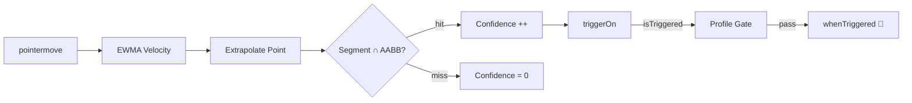
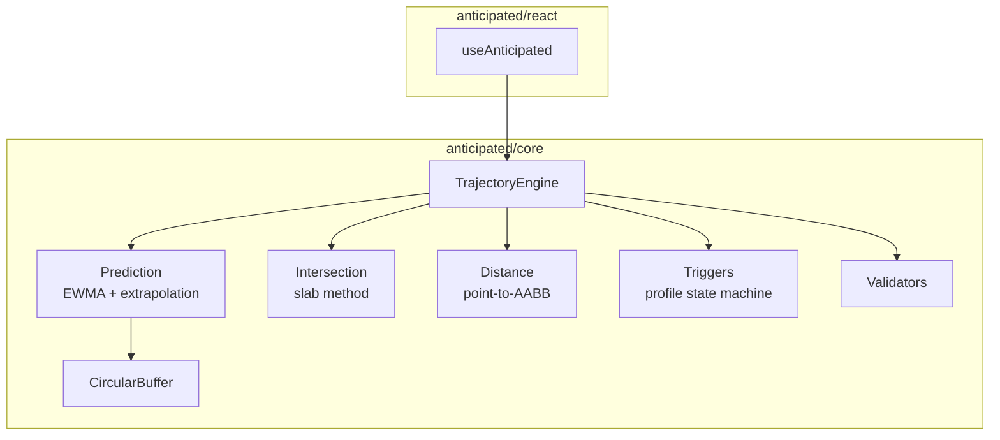

# anticipated

Cursor trajectory prediction for the web. Knows where the user is going before they get there.

Uses EWMA-smoothed velocity extrapolation + finite-segment/AABB intersection to predict which UI element a cursor is heading toward — then fires callbacks with configurable trigger profiles.

```
pnpm add anticipated
```

## Quick Start

### React

```tsx
import { useAnticipated } from 'anticipated/react'

function Nav() {
  const { register, useSnapshot } = useAnticipated()

  const ref = register('settings', {
    whenApproaching: () => prefetchSettingsData(),
    tolerance: 20,
  })

  const snap = useSnapshot('settings')

  return (
    <a ref={ref} style={{ opacity: snap?.confidence ?? 0.4 }}>
      Settings
    </a>
  )
}
```

### Vanilla

```ts
import { TrajectoryEngine } from 'anticipated/core'

const engine = new TrajectoryEngine()

engine.register('cta', document.getElementById('cta')!, {
  triggerOn: (snap) => ({
    isTriggered: snap.isIntersecting && snap.confidence > 0.5,
  }),
  whenTriggered: () => preloadCheckoutBundle(),
  profile: { type: 'on_enter' },
  tolerance: 30,
})

engine.connect()
```

---

## How It Works



Each animation frame:

1. **Smooth** — raw pointer velocity → EWMA-smoothed velocity
2. **Predict** — current position + velocity × window = predicted point
3. **Intersect** — test segment `[cursor → predicted]` against each element's expanded AABB
4. **Score** — consecutive hit frames / saturation frames = confidence (0–1)
5. **Gate** — user's `triggerOn` predicate → trigger profile (`once`, `on_enter`, etc.) → fire callback

---

## Architecture



---

## API Reference

### `TrajectoryEngine`

The core class. Framework-agnostic.

```ts
const engine = new TrajectoryEngine(options?)
```

| Option | Type | Default | Description |
|---|---|---|---|
| `predictionWindow` | `number` | `150` | Lookahead in ms (50–500) |
| `smoothingFactor` | `number` | `0.3` | EWMA alpha (0–1]. Lower = smoother |
| `bufferSize` | `number` | `8` | Position history size (2–30) |
| `defaultTolerance` | `Tolerance` | `0` | Default hitbox expansion (px) |
| `eventTarget` | `EventTarget` | `document` | Custom pointer event source |

#### Methods

| Method | Description |
|---|---|
| `register(id, element, config)` | Track an element |
| `unregister(id)` | Stop tracking |
| `connect()` | Start listening to pointer events |
| `disconnect()` | Stop listening, keep registrations |
| `destroy()` | Full teardown |
| `trigger(id, options?)` | Imperatively fire an element's callback |
| `getSnapshot(id)` | Current snapshot (non-reactive) |
| `getAllSnapshots()` | All snapshots as `ReadonlyMap` |
| `subscribe(cb)` | Global change listener. Returns unsubscribe. |
| `subscribeToElement(id)` | Per-element subscription factory |
| `invalidateRects()` | Force bounding-rect refresh |

### `useAnticipated(options?)`

React hook. Creates and manages a `TrajectoryEngine` lifecycle.

```ts
const { register, useSnapshot, getSnapshot, trigger } = useAnticipated(options?)
```

| Return | Type | Description |
|---|---|---|
| `register(id, config)` | `RefCallback<HTMLElement>` | Returns a stable ref callback. Attach to JSX. |
| `useSnapshot(id)` | `TrajectorySnapshot \| undefined` | Reactive snapshot via `useSyncExternalStore` |
| `getSnapshot(id)` | `TrajectorySnapshot \| undefined` | Non-reactive read |
| `trigger(id, opts?)` | `void` | Imperative trigger |
| `engine` | `TrajectoryEngine \| null` | Underlying engine instance |

### Shared Context (Multiple Components)

When multiple components need trajectory data, use `TrajectoryProvider` to share a single engine:

```tsx
import { TrajectoryProvider, useSharedAnticipated } from 'anticipated/react'

function App() {
  return (
    <TrajectoryProvider options={{ predictionWindow: 150 }}>
      <Nav />
      <Content />
    </TrajectoryProvider>
  )
}

function Nav() {
  const { register, useSnapshot } = useSharedAnticipated()
  const ref = register('settings', { whenApproaching: () => prefetch(), tolerance: 20 })
  const snap = useSnapshot('settings')
  return <a ref={ref}>Settings ({snap?.confidence.toFixed(2)})</a>
}
```

> **Rule:** Call `useAnticipated()` once (low-level) or wrap with `<TrajectoryProvider>` (recommended). Don't call `useAnticipated()` in multiple components — each call creates a separate engine.

---

## Config

### Convenience Config

Shorthand for the common "do something when the cursor approaches" pattern.

```ts
register('nav', el, {
  whenApproaching: () => prefetch('/settings'),
  tolerance: 20,
})
```

Expands to `{ profile: 'on_enter', confidence > 0.5, isIntersecting }`.

### Full Config

Full control over trigger conditions and firing behavior.

```ts
register('btn', el, {
  triggerOn: (snap) => ({
    isTriggered: snap.isIntersecting && snap.confidence > 0.7,
    reason: 'trajectory',
  }),
  whenTriggered: () => preload(),
  profile: { type: 'cooldown', intervalMs: 500 },
  tolerance: { top: 40, right: 20, bottom: 10, left: 20 },
})
```

### Trigger Profiles

Control **how often** `whenTriggered` fires.

```mermaid
stateDiagram-v2
  [*] --> Idle

  state "once" as once {
    Idle --> Fired: first trigger
    Fired --> Fired: subsequent triggers (blocked)
  }

  state "on_enter" as enter {
    Idle --> Active: enter
    Active --> Idle: leave
    Idle --> Active: re-enter (fires again)
  }

  state "every_frame" as frame {
    Idle --> Firing: triggered
    Firing --> Firing: still triggered
    Firing --> Idle: not triggered
  }

  state "cooldown" as cool {
    Idle --> Fired: enter
    Fired --> Cooldown: waiting intervalMs
    Cooldown --> Fired: re-enter after cooldown
  }
```

| Profile | Fires | Use Case |
|---|---|---|
| `once` | First time only | Prefetch, analytics beacon |
| `on_enter` | Each enter (not while inside) | Hover preview, tooltip prep |
| `every_frame` | Every frame while triggered | Live distance display, animation |
| `cooldown` | At most once per `intervalMs` | Rate-limited prefetch |

---

## TrajectorySnapshot

Every registered element produces a snapshot each frame:

```ts
type TrajectorySnapshot = {
  isIntersecting: boolean   // trajectory ray hits the element's AABB
  distancePx: number        // cursor distance to nearest edge (0 = inside)
  velocity: Velocity        // { x, y, magnitude, angle }
  confidence: number        // 0–1, ramps over consecutive hit frames
  predictedPoint: Point     // where the cursor will be in predictionWindow ms
}
```

### Confidence Scoring

Confidence is computed per element per frame via a weighted factor pipeline:
- **Trajectory alignment** — does the cursor ray intersect the element?
- **Distance** — exponential decay by cursor-to-element distance
- **Deceleration** — sigmoid detecting cursor slowdown near target
- **Erratic penalty** — circular variance penalizing jittery movement

Each factor produces a 0–1 score, aggregated multiplicatively. Temporal smoothing via accelerating decay prevents oscillation at element boundaries.

---

## Tolerance

Expands an element's bounding box for hit testing. Useful for small targets.

```ts
// Uniform: 20px all sides
{ tolerance: 20 }

// Directional: expand more toward likely approach direction
{ tolerance: { top: 40, right: 20, bottom: 10, left: 20 } }
```

---

## Entrypoints

| Import | Contents |
|---|---|
| `anticipated` | Core re-exports |
| `anticipated/core` | `TrajectoryEngine`, math utils, types, constants |
| `anticipated/react` | `useAnticipated` hook |

React is an **optional** peer dependency — `anticipated/core` has zero runtime dependencies.

---

## Example

```
pnpm example
```

Opens a demo page at `http://localhost:5173` with a sidebar nav + form. Elements glow green as trajectory confidence increases above 0.5.

---

## Tuning Constants

All constants are exported from `anticipated/core` for reference:

| Constant | Value | Purpose |
|---|---|---|
| `DEFAULT_PREDICTION_WINDOW_MS` | `150` | Lookahead window |
| `DEFAULT_SMOOTHING_FACTOR` | `0.3` | EWMA alpha |
| `DEFAULT_BUFFER_SIZE` | `8` | Position ring buffer capacity |
| `MIN_VELOCITY_THRESHOLD` | `5` | Below this px/s, cursor is "stationary" |
| `DECELERATION_WINDOW_FLOOR` | `0.3` | Minimum prediction window scale |
| `DECELERATION_DAMPENING` | `0.5` | How much deceleration shrinks window |
| `DEFAULT_CONFIDENCE_THRESHOLD` | `0.5` | Convenience config threshold |
| `DEFAULT_COOLDOWN_INTERVAL_MS` | `300` | Default cooldown period |
