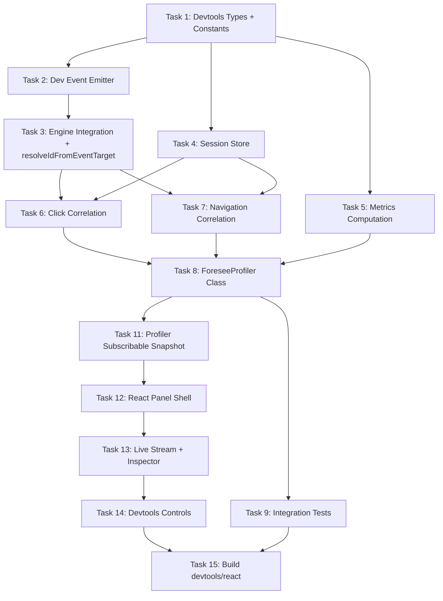

# foresee/devtools Implementation Plan

> **For Claude:** REQUIRED SUB-SKILL: Use superpowers:executing-plans to implement this plan task-by-task.

**Goal:** Implement `foresee/devtools` — a prediction value profiler that measures whether foresee's cursor trajectory predictions actually delivered measurable UX gains, including across multi-step navigation flows.

**Architecture:** Engine emits typed dev events (zero-cost when no listeners). A `ForeseeProfiler` class correlates prediction events against actual user actions (clicks, navigations) to compute precision, recall, lead time, and per-flow time savings. Cross-navigation state persists in sessionStorage. An interactive React panel (`<ForeseeDevtools />`) provides TanStack-style developer UX.

**Tech Stack:** TypeScript (strict), Vitest + happy-dom, tsup (ESM + CJS), React 19, @testing-library/react, pnpm. No external runtime dependencies in core/devtools. React is a peer dep for devtools/react only.

---

## Dependency Graph



## Task Order

| Task | Name | Depends On | Est. Time |
|------|------|-----------|-----------|
| 1 | Devtools Types + Constants | — | 10 min |
| 2 | Dev Event Emitter | 1 | 15 min |
| 3 | Engine Integration + resolveIdFromEventTarget | 2 | 25 min |
| 4 | Session Store | 1 | 15 min |
| 5 | Metrics Computation | 1 | 15 min |
| 6 | Click Correlation | 3, 4 | 20 min |
| 7 | Navigation Correlation (History API + PendingNavigationRecord) | 3, 4 | 20 min |
| 8 | ForeseeProfiler Class | 5, 6, 7 | 25 min |
| 9 | Integration Tests | 8 | 20 min |
| 10 | Build + Exports (devtools) | 9 | 10 min |
| 11 | Profiler Subscribable Snapshot | 8 | 15 min |
| 12 | React Panel Shell | 11 | 25 min |
| 13 | Live Stream + Inspector | 12 | 25 min |
| 14 | Devtools Controls (pause/reset/copy) | 13 | 20 min |
| 15 | Build + Exports (devtools/react) | 9, 14 | 10 min |

---

## Task 1: Devtools Types + Constants

**Files:**
- Create: `src/devtools/types.ts`
- Create: `src/devtools/constants.ts`
- Test: `src/devtools/constants.test.ts`

**Step 1: Write the constants test**

```typescript
// src/devtools/constants.test.ts
import { describe, it, expect } from 'vitest'
import * as C from './constants.js'

describe('devtools constants', () => {
  it('has valid confirmation window', () => {
    expect(C.DEFAULT_CONFIRMATION_WINDOW_MS).toBeGreaterThan(0)
    expect(C.DEFAULT_CONFIRMATION_WINDOW_MS).toBeLessThanOrEqual(10000)
  })

  it('has valid max events stored', () => {
    expect(C.DEFAULT_MAX_EVENTS_STORED).toBeGreaterThan(0)
    expect(C.DEFAULT_MAX_EVENTS_STORED).toBeLessThanOrEqual(10000)
  })

  it('has valid flow break timeout', () => {
    expect(C.FLOW_BREAK_TIMEOUT_MS).toBeGreaterThan(C.DEFAULT_CONFIRMATION_WINDOW_MS)
  })

  it('has a session storage key', () => {
    expect(C.SESSION_STORAGE_KEY).toBe('foresee:profiler')
  })
})
```

**Step 2: Run test to verify it fails**

```bash
pnpm exec vitest run src/devtools/constants.test.ts
```
Expected: FAIL — module not found

**Step 3: Implement types.ts and constants.ts**

```typescript
// src/devtools/constants.ts
export const DEFAULT_CONFIRMATION_WINDOW_MS = 2000
export const DEFAULT_MAX_EVENTS_STORED = 500
export const SESSION_STORAGE_KEY = 'foresee:profiler'
export const FLOW_BREAK_TIMEOUT_MS = 30000
```

```typescript
// src/devtools/types.ts
import type { Point, TriggerReason } from '../core/types.js'

// --- Engine Dev Events ---

export type PredictionFiredEvent = {
  elementId: string
  timestamp: number
  confidence: number
  predictedPoint: Point
  triggerReason?: TriggerReason
}

export type CallbackStartEvent = {
  elementId: string
  timestamp: number
}

export type CallbackEndEvent = {
  elementId: string
  timestamp: number
  durationMs: number
  status: 'success' | 'error'
}

export interface ForeseeDevEventMap {
  'prediction:fired': PredictionFiredEvent
  'prediction:callback-start': CallbackStartEvent
  'prediction:callback-end': CallbackEndEvent
}

// --- Profiler Types ---

export type ProfilerOptions = {
  confirmationWindowMs?: number
  persistAcrossNavigations?: boolean
  maxEventsStored?: number
}

export type PredictionRecord = {
  elementId: string
  timestamp: number
  confidence: number
  callbackDurationMs?: number
  status?: 'success' | 'error'
  sourceUrl: string
}

export type ConfirmationRecord = {
  elementId: string
  predictionTimestamp: number
  confirmationTimestamp: number
  leadTimeMs: number
  sourceUrl: string
  confirmationType: 'click' | 'navigation' | 'manual'
}

export type FlowStep = {
  elementId: string
  sourceUrl: string
  leadTimeMs: number
  callbackDurationMs: number
}

export type FlowReport = {
  steps: FlowStep[]
  totalLeadTimeMs: number
  predictions: number
  confirmed: number
  precision: number
}

export type ProfilerReport = {
  predictions: number
  confirmed: number
  falsePositives: number
  missedNavigations: number
  precision: number
  recall: number
  f1: number
  avgLeadTimeMs: number
  totalTimeSavedMs: number
  avgCallbackDurationMs: number
  flows: FlowReport[]
}

// --- Session Store ---

export type PersistedState = {
  pendingPredictions: PredictionRecord[]
  confirmations: ConfirmationRecord[]
  currentFlowSteps: FlowStep[]
  completedFlows: FlowReport[]
  missedNavigations: number
  sessionStartedAt: number
}
```

**Step 4: Run test to verify it passes**

```bash
pnpm exec vitest run src/devtools/constants.test.ts
```
Expected: PASS

**Step 5: Commit**

```bash
git add -A && git commit -m "feat(devtools): add types and constants for prediction profiler"
```

---

## Task 2: Dev Event Emitter

**Files:**
- Create: `src/devtools/events.ts`
- Test: `src/devtools/events.test.ts`

The emitter is a standalone mixin-style module. The engine will call into it, but the emitter itself has no engine dependency.

**Step 1: Write the failing test**

```typescript
// src/devtools/events.test.ts
import { describe, it, expect, vi } from 'vitest'
import { DevEventEmitter } from './events.js'

describe('DevEventEmitter', () => {
  it('emits events to registered listeners', () => {
    const emitter = new DevEventEmitter()
    const listener = vi.fn()
    emitter.on('prediction:fired', listener)

    const event = {
      elementId: 'btn',
      timestamp: 100,
      confidence: 0.8,
      predictedPoint: { x: 150, y: 150 },
    }
    emitter.emit('prediction:fired', event)

    expect(listener).toHaveBeenCalledOnce()
    expect(listener).toHaveBeenCalledWith(event)
  })

  it('returns unsubscribe function', () => {
    const emitter = new DevEventEmitter()
    const listener = vi.fn()
    const unsub = emitter.on('prediction:fired', listener)

    unsub()
    emitter.emit('prediction:fired', {
      elementId: 'btn', timestamp: 100, confidence: 0.8,
      predictedPoint: { x: 0, y: 0 },
    })

    expect(listener).not.toHaveBeenCalled()
  })

  it('supports multiple listeners per event', () => {
    const emitter = new DevEventEmitter()
    const listener1 = vi.fn()
    const listener2 = vi.fn()
    emitter.on('prediction:fired', listener1)
    emitter.on('prediction:fired', listener2)

    emitter.emit('prediction:fired', {
      elementId: 'btn', timestamp: 100, confidence: 0.8,
      predictedPoint: { x: 0, y: 0 },
    })

    expect(listener1).toHaveBeenCalledOnce()
    expect(listener2).toHaveBeenCalledOnce()
  })

  it('hasListeners returns false when no listeners', () => {
    const emitter = new DevEventEmitter()
    expect(emitter.hasListeners()).toBe(false)
  })

  it('hasListeners returns true when listeners exist', () => {
    const emitter = new DevEventEmitter()
    emitter.on('prediction:fired', () => {})
    expect(emitter.hasListeners()).toBe(true)
  })

  it('hasListeners returns false after all unsubscribed', () => {
    const emitter = new DevEventEmitter()
    const unsub = emitter.on('prediction:fired', () => {})
    unsub()
    expect(emitter.hasListeners()).toBe(false)
  })

  it('isolates listener errors — does not throw', () => {
    const emitter = new DevEventEmitter()
    const badListener = vi.fn(() => { throw new Error('boom') })
    const goodListener = vi.fn()
    emitter.on('prediction:fired', badListener)
    emitter.on('prediction:fired', goodListener)

    expect(() => {
      emitter.emit('prediction:fired', {
        elementId: 'btn', timestamp: 100, confidence: 0.8,
        predictedPoint: { x: 0, y: 0 },
      })
    }).not.toThrow()

    expect(goodListener).toHaveBeenCalledOnce()
  })

  it('removeAll clears all listeners', () => {
    const emitter = new DevEventEmitter()
    const listener = vi.fn()
    emitter.on('prediction:fired', listener)
    emitter.on('prediction:callback-start', listener)
    emitter.removeAll()
    expect(emitter.hasListeners()).toBe(false)
  })
})
```

**Step 2: Run test to verify it fails**

```bash
pnpm exec vitest run src/devtools/events.test.ts
```

**Step 3: Implement DevEventEmitter**

```typescript
// src/devtools/events.ts
import type { ForeseeDevEventMap } from './types.js'

type Listener<K extends keyof ForeseeDevEventMap> = (data: ForeseeDevEventMap[K]) => void

export class DevEventEmitter {
  private readonly listeners = new Map<keyof ForeseeDevEventMap, Set<Listener<any>>>()

  on<K extends keyof ForeseeDevEventMap>(event: K, listener: Listener<K>): () => void {
    let set = this.listeners.get(event)
    if (!set) {
      set = new Set()
      this.listeners.set(event, set)
    }
    set.add(listener)
    return () => {
      set!.delete(listener)
      if (set!.size === 0) this.listeners.delete(event)
    }
  }

  emit<K extends keyof ForeseeDevEventMap>(event: K, data: ForeseeDevEventMap[K]): void {
    const set = this.listeners.get(event)
    if (!set) return
    for (const listener of set) {
      try { listener(data) } catch { /* never crash engine */ }
    }
  }

  hasListeners(): boolean {
    return this.listeners.size > 0
  }

  removeAll(): void {
    this.listeners.clear()
  }
}
```

**Step 4: Run test to verify it passes**

```bash
pnpm exec vitest run src/devtools/events.test.ts
```

**Step 5: Commit**

```bash
git add -A && git commit -m "feat(devtools): add DevEventEmitter with typed events and error isolation"
```

---

## Task 3: Engine Integration + resolveIdFromEventTarget

**Files:**
- Modify: `src/core/engine.ts`
- Test: `src/core/engine.test.ts` (add dev event + resolveId tests)

Add `onDev()` method, event emission, and `resolveIdFromEventTarget()` / `getElementById()` to `TrajectoryEngine`. The `resolveIdFromEventTarget` method enables click correlation (Task 6) and the devtools highlight overlay (Task 13) without exposing the internal elements map.

**Step 1: Write the failing test**

Add to existing `src/core/engine.test.ts`:

```typescript
// Add to src/core/engine.test.ts

describe('resolveIdFromEventTarget', () => {
  it('resolves a registered element', () => {
    const engine = new TrajectoryEngine()
    const el = document.createElement('div')
    vi.spyOn(el, 'getBoundingClientRect').mockReturnValue({
      left: 0, top: 0, right: 100, bottom: 100,
      width: 100, height: 100, x: 0, y: 0, toJSON: () => {},
    })
    engine.register('btn', el, {
      triggerOn: () => ({ isTriggered: false }),
      whenTriggered: () => {},
      profile: { type: 'once' },
    })

    expect(engine.resolveIdFromEventTarget(el)).toBe('btn')
  })

  it('resolves a child element inside a registered element', () => {
    const engine = new TrajectoryEngine()
    const parent = document.createElement('div')
    const child = document.createElement('span')
    parent.appendChild(child)
    vi.spyOn(parent, 'getBoundingClientRect').mockReturnValue({
      left: 0, top: 0, right: 100, bottom: 100,
      width: 100, height: 100, x: 0, y: 0, toJSON: () => {},
    })
    engine.register('link', parent, {
      triggerOn: () => ({ isTriggered: false }),
      whenTriggered: () => {},
      profile: { type: 'once' },
    })

    expect(engine.resolveIdFromEventTarget(child)).toBe('link')
  })

  it('returns null for unregistered elements', () => {
    const engine = new TrajectoryEngine()
    const el = document.createElement('div')
    expect(engine.resolveIdFromEventTarget(el)).toBeNull()
  })

  it('returns null for null target', () => {
    const engine = new TrajectoryEngine()
    expect(engine.resolveIdFromEventTarget(null)).toBeNull()
  })

  it('updates mapping when element is re-registered', () => {
    const engine = new TrajectoryEngine()
    const el1 = document.createElement('div')
    const el2 = document.createElement('div')
    vi.spyOn(el1, 'getBoundingClientRect').mockReturnValue({
      left: 0, top: 0, right: 100, bottom: 100,
      width: 100, height: 100, x: 0, y: 0, toJSON: () => {},
    })
    vi.spyOn(el2, 'getBoundingClientRect').mockReturnValue({
      left: 0, top: 0, right: 100, bottom: 100,
      width: 100, height: 100, x: 0, y: 0, toJSON: () => {},
    })
    engine.register('btn', el1, {
      triggerOn: () => ({ isTriggered: false }),
      whenTriggered: () => {},
      profile: { type: 'once' },
    })
    engine.register('btn', el2, {
      triggerOn: () => ({ isTriggered: false }),
      whenTriggered: () => {},
      profile: { type: 'once' },
    })

    expect(engine.resolveIdFromEventTarget(el2)).toBe('btn')
    expect(engine.resolveIdFromEventTarget(el1)).toBeNull()
  })

  it('clears mapping on unregister', () => {
    const engine = new TrajectoryEngine()
    const el = document.createElement('div')
    vi.spyOn(el, 'getBoundingClientRect').mockReturnValue({
      left: 0, top: 0, right: 100, bottom: 100,
      width: 100, height: 100, x: 0, y: 0, toJSON: () => {},
    })
    engine.register('btn', el, {
      triggerOn: () => ({ isTriggered: false }),
      whenTriggered: () => {},
      profile: { type: 'once' },
    })
    engine.unregister('btn')
    expect(engine.resolveIdFromEventTarget(el)).toBeNull()
  })
})

describe('getElementById', () => {
  it('returns registered element', () => {
    const engine = new TrajectoryEngine()
    const el = document.createElement('div')
    vi.spyOn(el, 'getBoundingClientRect').mockReturnValue({
      left: 0, top: 0, right: 100, bottom: 100,
      width: 100, height: 100, x: 0, y: 0, toJSON: () => {},
    })
    engine.register('btn', el, {
      triggerOn: () => ({ isTriggered: false }),
      whenTriggered: () => {},
      profile: { type: 'once' },
    })

    expect(engine.getElementById('btn')).toBe(el)
  })

  it('returns null for unregistered id', () => {
    const engine = new TrajectoryEngine()
    expect(engine.getElementById('nonexistent')).toBeNull()
  })
})

describe('dev events', () => {
  it('onDev subscribes to dev events', () => {
    const engine = new TrajectoryEngine()
    const listener = vi.fn()
    const unsub = engine.onDev('prediction:fired', listener)
    expect(typeof unsub).toBe('function')
    unsub()
  })

  it('emits prediction:fired when callback fires via trigger()', () => {
    const engine = new TrajectoryEngine()
    const el = document.createElement('div')
    vi.spyOn(el, 'getBoundingClientRect').mockReturnValue({
      left: 100, top: 100, right: 200, bottom: 200,
      width: 100, height: 100, x: 100, y: 100, toJSON: () => {},
    })

    const whenTriggered = vi.fn()
    engine.register('btn', el, {
      triggerOn: () => ({ isTriggered: false }),
      whenTriggered,
      profile: { type: 'on_enter' },
    })

    const firedListener = vi.fn()
    const callbackStartListener = vi.fn()
    const callbackEndListener = vi.fn()
    engine.onDev('prediction:fired', firedListener)
    engine.onDev('prediction:callback-start', callbackStartListener)
    engine.onDev('prediction:callback-end', callbackEndListener)

    engine.trigger('btn')

    expect(firedListener).toHaveBeenCalledOnce()
    expect(firedListener).toHaveBeenCalledWith(
      expect.objectContaining({ elementId: 'btn' })
    )
    expect(callbackStartListener).toHaveBeenCalledOnce()
    expect(callbackEndListener).toHaveBeenCalledOnce()
    expect(callbackEndListener).toHaveBeenCalledWith(
      expect.objectContaining({ elementId: 'btn', status: 'success' })
    )
  })

  it('does not emit events when no listeners attached', () => {
    const engine = new TrajectoryEngine()
    const el = document.createElement('div')
    vi.spyOn(el, 'getBoundingClientRect').mockReturnValue({
      left: 100, top: 100, right: 200, bottom: 200,
      width: 100, height: 100, x: 100, y: 100, toJSON: () => {},
    })

    const whenTriggered = vi.fn()
    engine.register('btn', el, {
      triggerOn: () => ({ isTriggered: false }),
      whenTriggered,
      profile: { type: 'on_enter' },
    })

    // No onDev listeners attached — trigger should still work
    expect(() => engine.trigger('btn')).not.toThrow()
    expect(whenTriggered).toHaveBeenCalledOnce()
  })
})
```

**Step 2: Run test to verify it fails**

```bash
pnpm exec vitest run src/core/engine.test.ts
```
Expected: FAIL — `onDev` not defined

**Step 3: Modify engine.ts**

Changes needed:
1. Import `DevEventEmitter` from `../devtools/events.js`
2. Add `private readonly devEmitter = new DevEventEmitter()` field
3. Add `private readonly elementToId = new WeakMap<HTMLElement, string>()` field
4. Add public `onDev()` method that delegates to `devEmitter.on()`
5. Add public `resolveIdFromEventTarget(target: EventTarget | null): string | null` — walks `parentElement` chain, checks WeakMap
6. Add public `getElementById(id: string): HTMLElement | null` — returns element from the `elements` map
7. Update `register()`: add to WeakMap; on re-register with different element, delete old from WeakMap
8. Update `unregister()`: delete from WeakMap
9. Modify `safeFireCallback()` to accept `elementId` parameter and emit events when `devEmitter.hasListeners()` is true
10. Modify `update()` loop: emit `prediction:fired` right before `safeFireCallback` when `canFire` is true
11. Modify `trigger()` method: emit `prediction:fired` before calling `safeFireCallback`

Key constraint: the `DevEventEmitter` import is always present (it's a lightweight class), but the `hasListeners()` gate ensures zero runtime cost when no profiler is attached. The `WeakMap` is O(1) and does not prevent garbage collection of unmounted elements.

**Step 4: Run test to verify it passes**

```bash
pnpm exec vitest run src/core/engine.test.ts
```

**Step 5: Run full test suite — no regressions**

```bash
pnpm exec vitest run
```

**Step 6: Commit**

```bash
git add -A && git commit -m "feat(devtools): add onDev(), resolveIdFromEventTarget(), getElementById() to TrajectoryEngine"
```

---

## Task 4: Session Store

**Files:**
- Create: `src/devtools/session-store.ts`
- Test: `src/devtools/session-store.test.ts`

Ring buffer backed by sessionStorage. Survives full page navigations.

**Step 1: Write the failing test**

```typescript
// src/devtools/session-store.test.ts
import { describe, it, expect, beforeEach, vi } from 'vitest'
import { SessionStore } from './session-store.js'
import { SESSION_STORAGE_KEY } from './constants.js'
import type { PersistedState, PredictionRecord } from './types.js'

describe('SessionStore', () => {
  beforeEach(() => {
    sessionStorage.clear()
  })

  it('initializes with empty state when no stored data', () => {
    const store = new SessionStore(500)
    const state = store.getState()
    expect(state.pendingPredictions).toEqual([])
    expect(state.confirmations).toEqual([])
    expect(state.completedFlows).toEqual([])
    expect(state.missedNavigations).toBe(0)
  })

  it('persists and restores predictions', () => {
    const store = new SessionStore(500)
    const prediction: PredictionRecord = {
      elementId: 'btn',
      timestamp: 100,
      confidence: 0.8,
      sourceUrl: '/page-a',
    }
    store.addPrediction(prediction)
    store.flush()

    // Simulate new page load — read from sessionStorage
    const store2 = new SessionStore(500)
    const state = store2.getState()
    expect(state.pendingPredictions).toHaveLength(1)
    expect(state.pendingPredictions[0].elementId).toBe('btn')
  })

  it('evicts oldest predictions when max exceeded', () => {
    const store = new SessionStore(3) // max 3 events
    for (let i = 0; i < 5; i++) {
      store.addPrediction({
        elementId: `btn-${i}`,
        timestamp: i * 100,
        confidence: 0.8,
        sourceUrl: '/test',
      })
    }
    store.flush()

    const store2 = new SessionStore(3)
    const state = store2.getState()
    // Should only have the last 3
    expect(state.pendingPredictions).toHaveLength(3)
    expect(state.pendingPredictions[0].elementId).toBe('btn-2')
  })

  it('handles corrupted sessionStorage gracefully', () => {
    sessionStorage.setItem(SESSION_STORAGE_KEY, 'not valid json{{{')
    const store = new SessionStore(500)
    const state = store.getState()
    // Should fall back to empty state, not throw
    expect(state.pendingPredictions).toEqual([])
  })

  it('handles sessionStorage unavailable gracefully', () => {
    // Mock sessionStorage.getItem to throw (e.g. private browsing quota)
    const originalGetItem = sessionStorage.getItem
    sessionStorage.getItem = () => { throw new Error('quota exceeded') }

    const store = new SessionStore(500)
    const state = store.getState()
    expect(state.pendingPredictions).toEqual([])

    sessionStorage.getItem = originalGetItem
  })

  it('clear removes all stored data', () => {
    const store = new SessionStore(500)
    store.addPrediction({
      elementId: 'btn',
      timestamp: 100,
      confidence: 0.8,
      sourceUrl: '/test',
    })
    store.flush()
    store.clear()

    const store2 = new SessionStore(500)
    expect(store2.getState().pendingPredictions).toEqual([])
  })
})
```

**Step 2: Run test to verify it fails**

```bash
pnpm exec vitest run src/devtools/session-store.test.ts
```

**Step 3: Implement SessionStore**

```typescript
// src/devtools/session-store.ts
import { SESSION_STORAGE_KEY } from './constants.js'
import type { PersistedState, PredictionRecord, ConfirmationRecord, FlowStep, FlowReport } from './types.js'

function createEmptyState(): PersistedState {
  return {
    pendingPredictions: [],
    confirmations: [],
    currentFlowSteps: [],
    completedFlows: [],
    missedNavigations: 0,
    sessionStartedAt: Date.now(),
  }
}

export class SessionStore {
  private state: PersistedState
  private readonly maxEvents: number

  constructor(maxEvents: number) {
    this.maxEvents = maxEvents
    this.state = this.load()
  }

  getState(): PersistedState {
    return this.state
  }

  addPrediction(record: PredictionRecord): void {
    this.state.pendingPredictions.push(record)
    this.evict()
  }

  addConfirmation(record: ConfirmationRecord): void {
    this.state.confirmations.push(record)
    // Remove from pending
    this.state.pendingPredictions = this.state.pendingPredictions.filter(
      (p) => !(p.elementId === record.elementId && p.timestamp === record.predictionTimestamp)
    )
  }

  addFlowStep(step: FlowStep): void {
    this.state.currentFlowSteps.push(step)
  }

  completeFlow(flow: FlowReport): void {
    this.state.completedFlows.push(flow)
    this.state.currentFlowSteps = []
  }

  incrementMissedNavigations(): void {
    this.state.missedNavigations++
  }

  flush(): void {
    try {
      sessionStorage.setItem(SESSION_STORAGE_KEY, JSON.stringify(this.state))
    } catch {
      // sessionStorage full or unavailable — silent fail
    }
  }

  clear(): void {
    this.state = createEmptyState()
    try {
      sessionStorage.removeItem(SESSION_STORAGE_KEY)
    } catch {
      // silent fail
    }
  }

  private load(): PersistedState {
    try {
      const raw = sessionStorage.getItem(SESSION_STORAGE_KEY)
      if (!raw) return createEmptyState()
      const parsed = JSON.parse(raw)
      // Basic shape validation
      if (parsed && Array.isArray(parsed.pendingPredictions)) {
        return parsed as PersistedState
      }
      return createEmptyState()
    } catch {
      return createEmptyState()
    }
  }

  private evict(): void {
    if (this.state.pendingPredictions.length > this.maxEvents) {
      this.state.pendingPredictions = this.state.pendingPredictions.slice(-this.maxEvents)
    }
  }
}
```

**Step 4: Run test to verify it passes**

```bash
pnpm exec vitest run src/devtools/session-store.test.ts
```

**Step 5: Commit**

```bash
git add -A && git commit -m "feat(devtools): add SessionStore with sessionStorage persistence and ring buffer eviction"
```

---

## Task 5: Metrics Computation

**Files:**
- Create: `src/devtools/metrics.ts`
- Test: `src/devtools/metrics.test.ts`

Pure functions that compute precision, recall, F1, lead time, and flow reports from raw event data.

**Step 1: Write the failing test**

```typescript
// src/devtools/metrics.test.ts
import { describe, it, expect } from 'vitest'
import { computeReport } from './metrics.js'
import type { PersistedState } from './types.js'

function createState(overrides: Partial<PersistedState> = {}): PersistedState {
  return {
    pendingPredictions: [],
    confirmations: [],
    currentFlowSteps: [],
    completedFlows: [],
    missedNavigations: 0,
    sessionStartedAt: 0,
    ...overrides,
  }
}

describe('computeReport', () => {
  it('returns zeros for empty state', () => {
    const report = computeReport(createState())
    expect(report.predictions).toBe(0)
    expect(report.confirmed).toBe(0)
    expect(report.precision).toBe(0)
    expect(report.recall).toBe(0)
    expect(report.f1).toBe(0)
  })

  it('computes precision correctly', () => {
    const report = computeReport(createState({
      confirmations: [
        { elementId: 'a', predictionTimestamp: 100, confirmationTimestamp: 200, leadTimeMs: 100, sourceUrl: '/', confirmationType: 'click' },
        { elementId: 'b', predictionTimestamp: 300, confirmationTimestamp: 400, leadTimeMs: 100, sourceUrl: '/', confirmationType: 'click' },
      ],
      pendingPredictions: [
        // 1 unconfirmed = 1 false positive
        { elementId: 'c', timestamp: 500, confidence: 0.8, sourceUrl: '/' },
      ],
    }))
    // 2 confirmed, 1 false positive → precision = 2/3
    expect(report.confirmed).toBe(2)
    expect(report.falsePositives).toBe(1)
    expect(report.precision).toBeCloseTo(2 / 3, 2)
  })

  it('computes recall correctly', () => {
    const report = computeReport(createState({
      confirmations: [
        { elementId: 'a', predictionTimestamp: 100, confirmationTimestamp: 200, leadTimeMs: 100, sourceUrl: '/', confirmationType: 'click' },
      ],
      missedNavigations: 2,
    }))
    // 1 confirmed, 2 missed → recall = 1/3
    expect(report.confirmed).toBe(1)
    expect(report.missedNavigations).toBe(2)
    expect(report.recall).toBeCloseTo(1 / 3, 2)
  })

  it('computes F1 as harmonic mean', () => {
    const report = computeReport(createState({
      confirmations: [
        { elementId: 'a', predictionTimestamp: 100, confirmationTimestamp: 200, leadTimeMs: 100, sourceUrl: '/', confirmationType: 'click' },
      ],
      pendingPredictions: [
        { elementId: 'b', timestamp: 300, confidence: 0.8, sourceUrl: '/' },
      ],
      missedNavigations: 1,
    }))
    // precision = 1/2, recall = 1/2, F1 = 0.5
    expect(report.f1).toBeCloseTo(0.5, 2)
  })

  it('computes lead time correctly', () => {
    const report = computeReport(createState({
      confirmations: [
        { elementId: 'a', predictionTimestamp: 100, confirmationTimestamp: 400, leadTimeMs: 300, sourceUrl: '/', confirmationType: 'click' },
        { elementId: 'b', predictionTimestamp: 500, confirmationTimestamp: 700, leadTimeMs: 200, sourceUrl: '/', confirmationType: 'click' },
      ],
    }))
    expect(report.avgLeadTimeMs).toBeCloseTo(250, 0)
    expect(report.totalTimeSavedMs).toBeCloseTo(500, 0)
  })

  it('includes completed flows in report', () => {
    const report = computeReport(createState({
      confirmations: [
        { elementId: 'a', predictionTimestamp: 100, confirmationTimestamp: 200, leadTimeMs: 100, sourceUrl: '/', confirmationType: 'click' },
      ],
      completedFlows: [
        {
          steps: [
            { elementId: 'nav-a', sourceUrl: '/', leadTimeMs: 200, callbackDurationMs: 50 },
            { elementId: 'nav-b', sourceUrl: '/a', leadTimeMs: 150, callbackDurationMs: 30 },
          ],
          totalLeadTimeMs: 350,
          predictions: 2,
          confirmed: 2,
          precision: 1.0,
        },
      ],
    }))
    expect(report.flows).toHaveLength(1)
    expect(report.flows[0].totalLeadTimeMs).toBe(350)
  })
})
```

**Step 2: Run test to verify it fails**

```bash
pnpm exec vitest run src/devtools/metrics.test.ts
```

**Step 3: Implement metrics computation**

```typescript
// src/devtools/metrics.ts
import type { PersistedState, ProfilerReport } from './types.js'

export function computeReport(state: PersistedState): ProfilerReport {
  const confirmed = state.confirmations.length
  const falsePositives = state.pendingPredictions.length // unconfirmed = FP
  const missedNavigations = state.missedNavigations
  const predictions = confirmed + falsePositives

  const precision = predictions > 0 ? confirmed / predictions : 0
  const recall = (confirmed + missedNavigations) > 0
    ? confirmed / (confirmed + missedNavigations)
    : 0
  const f1 = (precision + recall) > 0
    ? (2 * precision * recall) / (precision + recall)
    : 0

  const leadTimes = state.confirmations.map((c) => c.leadTimeMs)
  const avgLeadTimeMs = leadTimes.length > 0
    ? leadTimes.reduce((a, b) => a + b, 0) / leadTimes.length
    : 0
  const totalTimeSavedMs = leadTimes.reduce((a, b) => a + b, 0)

  const callbackDurations = state.confirmations
    .map((c) => {
      const pred = state.pendingPredictions.find(
        (p) => p.elementId === c.elementId && p.timestamp === c.predictionTimestamp
      )
      return pred?.callbackDurationMs
    })
    .filter((d): d is number => d !== undefined)
  const avgCallbackDurationMs = callbackDurations.length > 0
    ? callbackDurations.reduce((a, b) => a + b, 0) / callbackDurations.length
    : 0

  return {
    predictions,
    confirmed,
    falsePositives,
    missedNavigations,
    precision,
    recall,
    f1,
    avgLeadTimeMs,
    totalTimeSavedMs,
    avgCallbackDurationMs,
    flows: [...state.completedFlows],
  }
}
```

**Step 4: Run test to verify it passes**

```bash
pnpm exec vitest run src/devtools/metrics.test.ts
```

**Step 5: Commit**

```bash
git add -A && git commit -m "feat(devtools): add metrics computation — precision, recall, F1, lead time, flows"
```

---

## Task 6: Click Correlation

**Files:**
- Create: `src/devtools/correlation.ts`
- Test: `src/devtools/correlation.test.ts`

Listens for click events on tracked elements and correlates them against recent predictions.

**Step 1: Write the failing test**

```typescript
// src/devtools/correlation.test.ts
import { describe, it, expect, vi, beforeEach } from 'vitest'
import { ClickCorrelator } from './correlation.js'
import type { PredictionRecord } from './types.js'

describe('ClickCorrelator', () => {
  it('confirms prediction when element is clicked within window', () => {
    const onConfirm = vi.fn()
    const onMiss = vi.fn()
    const correlator = new ClickCorrelator({
      confirmationWindowMs: 2000,
      onConfirm,
      onMiss,
    })

    // Record a prediction at t=100
    const prediction: PredictionRecord = {
      elementId: 'btn',
      timestamp: 100,
      confidence: 0.8,
      sourceUrl: '/',
    }
    correlator.recordPrediction(prediction)

    // Simulate click at t=500 (within 2000ms window)
    correlator.handleClick('btn', 500)

    expect(onConfirm).toHaveBeenCalledOnce()
    expect(onConfirm).toHaveBeenCalledWith(
      expect.objectContaining({
        elementId: 'btn',
        leadTimeMs: 400,
        confirmationType: 'click',
      })
    )
  })

  it('does not confirm when click is outside window', () => {
    const onConfirm = vi.fn()
    const correlator = new ClickCorrelator({
      confirmationWindowMs: 500,
      onConfirm,
      onMiss: vi.fn(),
    })

    correlator.recordPrediction({
      elementId: 'btn',
      timestamp: 100,
      confidence: 0.8,
      sourceUrl: '/',
    })

    // Click at t=700 — outside 500ms window
    correlator.handleClick('btn', 700)

    expect(onConfirm).not.toHaveBeenCalled()
  })

  it('reports missed navigation for untracked element click', () => {
    const onMiss = vi.fn()
    const correlator = new ClickCorrelator({
      confirmationWindowMs: 2000,
      onConfirm: vi.fn(),
      onMiss,
    })

    // No prediction recorded for 'other-btn'
    correlator.handleClick('other-btn', 500)

    expect(onMiss).toHaveBeenCalledOnce()
    expect(onMiss).toHaveBeenCalledWith('other-btn')
  })

  it('uses most recent prediction when multiple exist', () => {
    const onConfirm = vi.fn()
    const correlator = new ClickCorrelator({
      confirmationWindowMs: 2000,
      onConfirm,
      onMiss: vi.fn(),
    })

    correlator.recordPrediction({ elementId: 'btn', timestamp: 100, confidence: 0.5, sourceUrl: '/' })
    correlator.recordPrediction({ elementId: 'btn', timestamp: 300, confidence: 0.9, sourceUrl: '/' })

    correlator.handleClick('btn', 500)

    // Should match the t=300 prediction, not t=100
    expect(onConfirm).toHaveBeenCalledWith(
      expect.objectContaining({ leadTimeMs: 200 })
    )
  })

  it('expirePending removes old predictions', () => {
    const onConfirm = vi.fn()
    const correlator = new ClickCorrelator({
      confirmationWindowMs: 500,
      onConfirm,
      onMiss: vi.fn(),
    })

    correlator.recordPrediction({ elementId: 'btn', timestamp: 100, confidence: 0.8, sourceUrl: '/' })

    // Expire at t=700 — prediction at t=100 is outside 500ms window
    const expired = correlator.expirePending(700)
    expect(expired).toHaveLength(1)
    expect(expired[0].elementId).toBe('btn')

    // Click should not match anything now
    correlator.handleClick('btn', 800)
    expect(onConfirm).not.toHaveBeenCalled()
  })
})
```

**Step 2: Run test to verify it fails**

```bash
pnpm exec vitest run src/devtools/correlation.test.ts
```

**Step 3: Implement ClickCorrelator**

The correlator maintains a list of pending predictions. When a click is reported:
1. Find the most recent prediction for that elementId within the confirmation window
2. If found → call `onConfirm` with a `ConfirmationRecord`
3. If not found → call `onMiss` (this was a navigation without prediction = FN)

Also provides `expirePending(now)` to evict predictions older than the confirmation window (classified as FP).

**Step 4: Run test to verify it passes**

```bash
pnpm exec vitest run src/devtools/correlation.test.ts
```

**Step 5: Commit**

```bash
git add -A && git commit -m "feat(devtools): add ClickCorrelator for prediction confirmation via element clicks"
```

---

## Task 7: Navigation Correlation

**Files:**
- Modify: `src/devtools/correlation.ts` (add `NavigationCorrelator` class)
- Test: `src/devtools/correlation.test.ts` (add navigation tests)

Handles cross-page navigation confirmation via PerformanceObserver and popstate.

**Step 1: Write the failing test**

Add to `src/devtools/correlation.test.ts`:

```typescript
describe('NavigationCorrelator', () => {
  it('confirms prediction from previous page on load', () => {
    const onConfirm = vi.fn()
    const correlator = new NavigationCorrelator({
      confirmationWindowMs: 2000,
      onConfirm,
    })

    // Simulate: prediction from previous page was persisted
    const pendingPredictions = [
      { elementId: 'checkout', timestamp: 100, confidence: 0.9, sourceUrl: '/cart' },
    ]

    // Current page loaded at t=400 (300ms after prediction)
    correlator.checkPendingOnLoad(pendingPredictions, '/checkout', 400)

    expect(onConfirm).toHaveBeenCalledOnce()
    expect(onConfirm).toHaveBeenCalledWith(
      expect.objectContaining({
        elementId: 'checkout',
        leadTimeMs: 300,
        confirmationType: 'navigation',
      })
    )
  })

  it('does not confirm if URL does not match any prediction sourceUrl pattern', () => {
    const onConfirm = vi.fn()
    const correlator = new NavigationCorrelator({
      confirmationWindowMs: 2000,
      onConfirm,
    })

    const pendingPredictions = [
      { elementId: 'settings', timestamp: 100, confidence: 0.9, sourceUrl: '/dashboard' },
    ]

    // Current URL has no relation to pending predictions
    correlator.checkPendingOnLoad(pendingPredictions, '/unrelated-page', 400)

    // Navigation correlator can only confirm by elementId matching — URL is metadata
    // Since we don't know the URL mapping, this relies on the profiler's manual annotation
    // for SPA routes. For MPA, the click on the tracked element fires before navigation.
    expect(onConfirm).not.toHaveBeenCalled()
  })

  it('respects confirmation window', () => {
    const onConfirm = vi.fn()
    const correlator = new NavigationCorrelator({
      confirmationWindowMs: 500,
      onConfirm,
    })

    const pendingPredictions = [
      { elementId: 'checkout', timestamp: 100, confidence: 0.9, sourceUrl: '/cart' },
    ]

    // Page loaded at t=700 — outside 500ms window
    correlator.checkPendingOnLoad(pendingPredictions, '/checkout', 700)

    expect(onConfirm).not.toHaveBeenCalled()
  })
})
```

**Step 2: Run test to verify it fails**

```bash
pnpm exec vitest run src/devtools/correlation.test.ts
```

**Step 3: Implement NavigationCorrelator**

The NavigationCorrelator runs on page load. It reads pending predictions from the SessionStore and checks if the most recent prediction's `elementId` matches a known element on the new page (or if the prediction was made within the confirmation window of the navigation timestamp).

For MPA navigations, the click on the tracked element fires the click correlator first (before the page unloads), so the NavigationCorrelator is primarily for confirming that the page load completed successfully — it pairs with click data persisted in sessionStorage.

**Step 4: Run test to verify it passes**

```bash
pnpm exec vitest run src/devtools/correlation.test.ts
```

**Step 5: Commit**

```bash
git add -A && git commit -m "feat(devtools): add NavigationCorrelator for cross-page prediction confirmation"
```

---

## Task 8: ForeseeProfiler Class

**Files:**
- Create: `src/devtools/profiler.ts`
- Test: `src/devtools/profiler.test.ts`

The main consumer-facing class. Ties together engine events, correlators, session store, and metrics.

**Step 1: Write the failing test**

```typescript
// src/devtools/profiler.test.ts
import { describe, it, expect, vi, beforeEach } from 'vitest'
import { ForeseeProfiler } from './profiler.js'
import { TrajectoryEngine } from '../core/engine.js'

describe('ForeseeProfiler', () => {
  let engine: TrajectoryEngine

  beforeEach(() => {
    sessionStorage.clear()
    engine = new TrajectoryEngine()
  })

  it('creates with default options', () => {
    const profiler = new ForeseeProfiler(engine)
    expect(profiler).toBeDefined()
  })

  it('creates with custom options', () => {
    const profiler = new ForeseeProfiler(engine, {
      confirmationWindowMs: 3000,
      persistAcrossNavigations: false,
      maxEventsStored: 100,
    })
    expect(profiler).toBeDefined()
  })

  it('getReport returns empty report initially', () => {
    const profiler = new ForeseeProfiler(engine)
    const report = profiler.getReport()
    expect(report.predictions).toBe(0)
    expect(report.confirmed).toBe(0)
    expect(report.precision).toBe(0)
    expect(report.flows).toEqual([])
  })

  it('confirmNavigation manually confirms a prediction', () => {
    const profiler = new ForeseeProfiler(engine)

    // Simulate: engine emitted a prediction event
    // (In real usage, the engine's update loop emits these)
    // For unit test, we reach into the profiler's internal state
    // by triggering an element registration + trigger

    const el = document.createElement('div')
    vi.spyOn(el, 'getBoundingClientRect').mockReturnValue({
      left: 100, top: 100, right: 200, bottom: 200,
      width: 100, height: 100, x: 100, y: 100, toJSON: () => {},
    })

    const cb = vi.fn()
    engine.register('nav-settings', el, {
      triggerOn: () => ({ isTriggered: false }),
      whenTriggered: cb,
      profile: { type: 'on_enter' },
    })

    // Trigger fires the prediction events
    engine.trigger('nav-settings')

    // Now manually confirm
    profiler.confirmNavigation('nav-settings')

    const report = profiler.getReport()
    expect(report.confirmed).toBe(1)
    expect(report.avgLeadTimeMs).toBeGreaterThanOrEqual(0)
  })

  it('reset clears all data', () => {
    const profiler = new ForeseeProfiler(engine)
    const el = document.createElement('div')
    vi.spyOn(el, 'getBoundingClientRect').mockReturnValue({
      left: 100, top: 100, right: 200, bottom: 200,
      width: 100, height: 100, x: 100, y: 100, toJSON: () => {},
    })

    engine.register('btn', el, {
      triggerOn: () => ({ isTriggered: false }),
      whenTriggered: () => {},
      profile: { type: 'on_enter' },
    })
    engine.trigger('btn')
    profiler.confirmNavigation('btn')

    profiler.reset()
    const report = profiler.getReport()
    expect(report.predictions).toBe(0)
    expect(report.confirmed).toBe(0)
  })

  it('destroy unsubscribes from engine', () => {
    const profiler = new ForeseeProfiler(engine)
    profiler.destroy()
    // Should not throw on double-destroy
    expect(() => profiler.destroy()).not.toThrow()
  })

  it('getFlows returns flow reports', () => {
    const profiler = new ForeseeProfiler(engine)
    const flows = profiler.getFlows()
    expect(flows).toEqual([])
  })
})
```

**Step 2: Run test to verify it fails**

```bash
pnpm exec vitest run src/devtools/profiler.test.ts
```

**Step 3: Implement ForeseeProfiler**

The profiler:
1. Subscribes to engine dev events via `engine.onDev()`
2. On `prediction:fired` → records prediction in ClickCorrelator + SessionStore
3. On `prediction:callback-end` → annotates the prediction record with callback duration
4. Attaches click listeners to the document (delegates — listens for clicks on any element, checks if it's a tracked element by matching against engine's registered IDs)
5. On page load → checks SessionStore for pending predictions from previous page
6. Exposes `getReport()`, `getFlows()`, `confirmNavigation()`, `reset()`, `destroy()`

**Step 4: Run test to verify it passes**

```bash
pnpm exec vitest run src/devtools/profiler.test.ts
```

**Step 5: Commit**

```bash
git add -A && git commit -m "feat(devtools): add ForeseeProfiler — prediction value measurement with multi-step flow tracking"
```

---

## Task 9: Integration Tests

**Files:**
- Create: `src/devtools/profiler.integration.test.ts`

End-to-end tests that simulate the full prediction → click → confirmation → report cycle.

**Step 1: Write integration tests**

```typescript
// src/devtools/profiler.integration.test.ts
import { describe, it, expect, vi, beforeEach } from 'vitest'
import { TrajectoryEngine } from '../core/engine.js'
import { ForeseeProfiler } from './profiler.js'

describe('ForeseeProfiler integration', () => {
  beforeEach(() => {
    sessionStorage.clear()
  })

  it('full cycle: register → trigger → click → report shows TP', () => {
    const engine = new TrajectoryEngine()
    const profiler = new ForeseeProfiler(engine)

    const el = document.createElement('div')
    vi.spyOn(el, 'getBoundingClientRect').mockReturnValue({
      left: 100, top: 100, right: 200, bottom: 200,
      width: 100, height: 100, x: 100, y: 100, toJSON: () => {},
    })

    const cb = vi.fn()
    engine.register('settings', el, {
      triggerOn: () => ({ isTriggered: false }),
      whenTriggered: cb,
      profile: { type: 'on_enter' },
    })

    // Prediction fires
    engine.trigger('settings')
    expect(cb).toHaveBeenCalledOnce()

    // User clicks the element (confirms prediction)
    profiler.confirmNavigation('settings')

    const report = profiler.getReport()
    expect(report.predictions).toBe(1)
    expect(report.confirmed).toBe(1)
    expect(report.falsePositives).toBe(0)
    expect(report.precision).toBe(1.0)

    profiler.destroy()
    engine.destroy()
  })

  it('false positive: prediction fires but user never clicks', () => {
    const engine = new TrajectoryEngine()
    const profiler = new ForeseeProfiler(engine, { confirmationWindowMs: 100 })

    const el = document.createElement('div')
    vi.spyOn(el, 'getBoundingClientRect').mockReturnValue({
      left: 100, top: 100, right: 200, bottom: 200,
      width: 100, height: 100, x: 100, y: 100, toJSON: () => {},
    })

    engine.register('cta', el, {
      triggerOn: () => ({ isTriggered: false }),
      whenTriggered: () => {},
      profile: { type: 'on_enter' },
    })

    engine.trigger('cta')

    // No click, no confirmation — pending prediction = FP
    const report = profiler.getReport()
    expect(report.predictions).toBe(1)
    expect(report.confirmed).toBe(0)
    expect(report.falsePositives).toBe(1)
    expect(report.precision).toBe(0)

    profiler.destroy()
    engine.destroy()
  })

  it('sessionStorage persistence: state survives across profiler instances', () => {
    const engine1 = new TrajectoryEngine()
    const profiler1 = new ForeseeProfiler(engine1, { persistAcrossNavigations: true })

    const el = document.createElement('div')
    vi.spyOn(el, 'getBoundingClientRect').mockReturnValue({
      left: 100, top: 100, right: 200, bottom: 200,
      width: 100, height: 100, x: 100, y: 100, toJSON: () => {},
    })

    engine1.register('checkout', el, {
      triggerOn: () => ({ isTriggered: false }),
      whenTriggered: () => {},
      profile: { type: 'on_enter' },
    })

    engine1.trigger('checkout')
    profiler1.destroy()
    engine1.destroy()

    // "New page load" — new engine + profiler reads from sessionStorage
    const engine2 = new TrajectoryEngine()
    const profiler2 = new ForeseeProfiler(engine2, { persistAcrossNavigations: true })

    const report = profiler2.getReport()
    // Previous prediction should be in pending (not yet confirmed on new page)
    expect(report.predictions).toBeGreaterThanOrEqual(1)

    profiler2.destroy()
    engine2.destroy()
  })
})
```

**Step 2: Run tests**

```bash
pnpm exec vitest run src/devtools/profiler.integration.test.ts
```

**Step 3: Run full test suite — no regressions**

```bash
pnpm exec vitest run
```

**Step 4: Commit**

```bash
git add -A && git commit -m "test(devtools): add integration tests for full profiler lifecycle"
```

---

## Task 10: Build + Exports

**Files:**
- Modify: `tsup.config.ts` (add devtools entrypoint)
- Modify: `package.json` (add `./devtools` export)
- Create: `src/devtools/index.ts` (barrel)

**Step 1: Create barrel export**

```typescript
// src/devtools/index.ts
export { ForeseeProfiler } from './profiler.js'
export { DevEventEmitter } from './events.js'
export type {
  ForeseeDevEventMap,
  PredictionFiredEvent,
  CallbackStartEvent,
  CallbackEndEvent,
  ProfilerOptions,
  ProfilerReport,
  FlowReport,
  FlowStep,
} from './types.js'
export {
  DEFAULT_CONFIRMATION_WINDOW_MS,
  DEFAULT_MAX_EVENTS_STORED,
  FLOW_BREAK_TIMEOUT_MS,
} from './constants.js'
```

**Step 2: Update tsup.config.ts**

Add `devtools: 'src/devtools/index.ts'` to the entry map.

**Step 3: Update package.json**

Add the `./devtools` export:
```json
"./devtools": {
  "types": "./dist/devtools.d.ts",
  "import": "./dist/devtools.js",
  "require": "./dist/devtools.cjs"
}
```

**Step 4: Verify full test suite passes**

```bash
pnpm exec vitest run
```

**Step 5: Verify build succeeds**

```bash
pnpm exec tsup
```

**Step 6: Verify package exports resolve**

```bash
node -e "const p = require('./dist/devtools.cjs'); console.log(Object.keys(p))"
node --input-type=module -e "import { ForeseeProfiler } from './dist/devtools.js'; console.log(typeof ForeseeProfiler)"
```

**Step 7: Verify TypeScript types generate**

```bash
ls dist/devtools.d.ts
```

**Step 8: Run typecheck**

```bash
pnpm exec tsc --noEmit
```

**Step 9: Commit**

```bash
git add -A && git commit -m "feat(devtools): add build configuration and foresee/devtools package export"
```

---

## Task 11: Profiler Subscribable Snapshot

**Files:**
- Modify: `src/devtools/profiler.ts`
- Test: `src/devtools/profiler.test.ts` (add subscription tests)

Add `subscribe()`, `getSnapshot()`, and `setEnabled()` to `ForeseeProfiler` so the React panel can use `useSyncExternalStore`.

**Step 1: Write the failing test**

Add to existing `src/devtools/profiler.test.ts`:

```typescript
describe('subscribable snapshot', () => {
  it('subscribe returns unsubscribe function', () => {
    const engine = new TrajectoryEngine()
    const profiler = new ForeseeProfiler(engine)
    const listener = vi.fn()
    const unsub = profiler.subscribe(listener)
    expect(typeof unsub).toBe('function')
    unsub()
    profiler.destroy()
  })

  it('getSnapshot returns stable shape', () => {
    const engine = new TrajectoryEngine()
    const profiler = new ForeseeProfiler(engine)
    const snap = profiler.getSnapshot()
    expect(snap).toHaveProperty('report')
    expect(snap).toHaveProperty('events')
    expect(snap).toHaveProperty('enabled')
    expect(snap.enabled).toBe(true)
    profiler.destroy()
  })

  it('notifies subscribers on new prediction event', () => {
    const engine = new TrajectoryEngine()
    const profiler = new ForeseeProfiler(engine)
    const el = document.createElement('div')
    vi.spyOn(el, 'getBoundingClientRect').mockReturnValue({
      left: 100, top: 100, right: 200, bottom: 200,
      width: 100, height: 100, x: 100, y: 100, toJSON: () => {},
    })
    engine.register('btn', el, {
      triggerOn: () => ({ isTriggered: false }),
      whenTriggered: () => {},
      profile: { type: 'on_enter' },
    })

    const listener = vi.fn()
    profiler.subscribe(listener)
    engine.trigger('btn')
    expect(listener).toHaveBeenCalled()
    profiler.destroy()
  })

  it('setEnabled(false) stops recording events', () => {
    const engine = new TrajectoryEngine()
    const profiler = new ForeseeProfiler(engine)
    profiler.setEnabled(false)
    expect(profiler.getSnapshot().enabled).toBe(false)
    profiler.destroy()
  })
})
```

**Step 2: Run test to verify it fails**

```bash
pnpm exec vitest run src/devtools/profiler.test.ts
```

**Step 3: Implement**

Add to `ForeseeProfiler`:
- `private readonly uiSubscribers = new Set<() => void>()`
- `private snapshotCache: ProfilerSnapshot | null = null`
- `subscribe(listener: () => void): () => void` — adds to Set, returns unsub
- `getSnapshot(): ProfilerSnapshot` — returns `{ report: this.getReport(), events: this.recentEvents, enabled: this.isEnabled }`
- `setEnabled(enabled: boolean): void` — toggles event recording; when false, detaches from engine events
- Invalidate snapshot cache and notify UI subscribers whenever internal state changes

**Step 4: Run test to verify it passes**

```bash
pnpm exec vitest run src/devtools/profiler.test.ts
```

**Step 5: Commit**

```bash
git add -A && git commit -m "feat(devtools): add subscribable profiler snapshot for UI consumers"
```

---

## Task 12: React Panel Shell

**Files:**
- Create: `src/devtools/react/ForeseeDevtools.tsx`
- Create: `src/devtools/react/DevtoolsToggle.tsx`
- Create: `src/devtools/react/DevtoolsPanel.tsx`
- Create: `src/devtools/react/index.ts`
- Test: `src/devtools/react/ForeseeDevtools.test.tsx`

**Step 1: Write the failing test**

```typescript
// src/devtools/react/ForeseeDevtools.test.tsx
import { describe, it, expect, vi } from 'vitest'
import { render, screen, fireEvent } from '@testing-library/react'
import { ForeseeDevtools } from './ForeseeDevtools.js'
import { ForeseeProfiler } from '../profiler.js'
import { TrajectoryEngine } from '../../core/engine.js'

describe('ForeseeDevtools', () => {
  it('renders closed by default', () => {
    const engine = new TrajectoryEngine()
    const profiler = new ForeseeProfiler(engine)
    render(<ForeseeDevtools profiler={profiler} />)

    // Toggle button should be visible
    expect(screen.getByRole('button', { name: /foresee/i })).toBeDefined()
    // Panel should not be visible
    expect(screen.queryByText('Predictions')).toBeNull()

    profiler.destroy()
  })

  it('opens panel on toggle click', () => {
    const engine = new TrajectoryEngine()
    const profiler = new ForeseeProfiler(engine)
    render(<ForeseeDevtools profiler={profiler} />)

    fireEvent.click(screen.getByRole('button', { name: /foresee/i }))

    // Panel should now be visible with scoreboard
    expect(screen.getByText('Predictions')).toBeDefined()
    expect(screen.getByText('Confirmed')).toBeDefined()
    expect(screen.getByText('Precision')).toBeDefined()

    profiler.destroy()
  })

  it('renders with initialIsOpen=true', () => {
    const engine = new TrajectoryEngine()
    const profiler = new ForeseeProfiler(engine)
    render(<ForeseeDevtools profiler={profiler} initialIsOpen={true} />)

    expect(screen.getByText('Predictions')).toBeDefined()

    profiler.destroy()
  })

  it('displays metrics from profiler snapshot', () => {
    const engine = new TrajectoryEngine()
    const profiler = new ForeseeProfiler(engine)
    render(<ForeseeDevtools profiler={profiler} initialIsOpen={true} />)

    // With no data, should show zeros
    expect(screen.getByText('0')).toBeDefined()

    profiler.destroy()
  })
})
```

**Step 2: Run test to verify it fails**

```bash
pnpm exec vitest run src/devtools/react/ForeseeDevtools.test.tsx
```

**Step 3: Implement**

Create `ForeseeDevtools.tsx`:
- Uses `useSyncExternalStore(profiler.subscribe, profiler.getSnapshot)` for concurrent-safe rendering
- Renders `DevtoolsToggle` (FAB button) when closed
- Renders `DevtoolsPanel` when open
- Accepts `dock` prop (`"bottom" | "right" | "left" | "floating"`)

Create `DevtoolsToggle.tsx`:
- Fixed-position button with "foresee" label
- Calls `onToggle()` callback

Create `DevtoolsPanel.tsx`:
- Docked container (position based on `dock` prop)
- Scoreboard row: predictions, confirmed, false positives, missed, precision, recall, F1, avg lead time, total saved
- Inline styles (no external CSS dependency)

Create `index.ts`:
- `export { ForeseeDevtools } from './ForeseeDevtools.js'`

**Step 4: Run test to verify it passes**

```bash
pnpm exec vitest run src/devtools/react/ForeseeDevtools.test.tsx
```

**Step 5: Commit**

```bash
git add -A && git commit -m "feat(devtools-react): add ForeseeDevtools panel shell with useSyncExternalStore"
```

---

## Task 13: Live Stream + Inspector

**Files:**
- Modify: `src/devtools/react/DevtoolsPanel.tsx`
- Create: `src/devtools/react/DevtoolsOverlay.tsx`
- Test: `src/devtools/react/ForeseeDevtools.test.tsx` (add stream/inspector tests)

**Step 1: Write the failing test**

Add to existing test file:

```typescript
describe('live event stream', () => {
  it('shows prediction events as they occur', () => {
    const engine = new TrajectoryEngine()
    const profiler = new ForeseeProfiler(engine)
    const el = document.createElement('div')
    vi.spyOn(el, 'getBoundingClientRect').mockReturnValue({
      left: 100, top: 100, right: 200, bottom: 200,
      width: 100, height: 100, x: 100, y: 100, toJSON: () => {},
    })
    engine.register('settings', el, {
      triggerOn: () => ({ isTriggered: false }),
      whenTriggered: () => {},
      profile: { type: 'on_enter' },
    })

    render(<ForeseeDevtools profiler={profiler} initialIsOpen={true} />)
    engine.trigger('settings')

    // Event should appear in the stream
    expect(screen.getByText('settings')).toBeDefined()

    profiler.destroy()
  })

  it('shows inspector when event row is clicked', () => {
    const engine = new TrajectoryEngine()
    const profiler = new ForeseeProfiler(engine)
    const el = document.createElement('div')
    vi.spyOn(el, 'getBoundingClientRect').mockReturnValue({
      left: 100, top: 100, right: 200, bottom: 200,
      width: 100, height: 100, x: 100, y: 100, toJSON: () => {},
    })
    engine.register('btn', el, {
      triggerOn: () => ({ isTriggered: false }),
      whenTriggered: () => {},
      profile: { type: 'on_enter' },
    })

    render(<ForeseeDevtools profiler={profiler} initialIsOpen={true} />)
    engine.trigger('btn')

    // Click the event row
    fireEvent.click(screen.getByText('btn'))

    // Inspector should show details
    expect(screen.getByText(/confidence/i)).toBeDefined()

    profiler.destroy()
  })
})
```

**Step 2: Run test to verify it fails**

```bash
pnpm exec vitest run src/devtools/react/ForeseeDevtools.test.tsx
```

**Step 3: Implement**

Update `DevtoolsPanel.tsx`:
- Add event list (ring buffer of recent events from profiler snapshot)
- Each row: elementId, status (predicted/confirmed/expired), timestamp, confidence
- Click row to select and show inspector

Create `DevtoolsOverlay.tsx`:
- On hover/selection, positions a highlight outline over the tracked DOM element
- Uses `engine.getElementById(id)` + `getBoundingClientRect()` to position
- Renders via a React portal to document.body

**Step 4: Run test to verify it passes**

**Step 5: Commit**

```bash
git add -A && git commit -m "feat(devtools-react): add live event list and inspector with element highlight"
```

---

## Task 14: Devtools Controls (pause/reset/copy)

**Files:**
- Modify: `src/devtools/react/DevtoolsPanel.tsx`
- Test: `src/devtools/react/ForeseeDevtools.test.tsx` (add control tests)

**Step 1: Write the failing test**

Add to existing test file:

```typescript
describe('devtools controls', () => {
  it('pause button stops new events', () => {
    const engine = new TrajectoryEngine()
    const profiler = new ForeseeProfiler(engine)
    render(<ForeseeDevtools profiler={profiler} initialIsOpen={true} />)

    fireEvent.click(screen.getByRole('button', { name: /pause/i }))

    expect(profiler.getSnapshot().enabled).toBe(false)

    profiler.destroy()
  })

  it('reset button clears data', () => {
    const engine = new TrajectoryEngine()
    const profiler = new ForeseeProfiler(engine)
    const el = document.createElement('div')
    vi.spyOn(el, 'getBoundingClientRect').mockReturnValue({
      left: 100, top: 100, right: 200, bottom: 200,
      width: 100, height: 100, x: 100, y: 100, toJSON: () => {},
    })
    engine.register('btn', el, {
      triggerOn: () => ({ isTriggered: false }),
      whenTriggered: () => {},
      profile: { type: 'on_enter' },
    })
    engine.trigger('btn')

    render(<ForeseeDevtools profiler={profiler} initialIsOpen={true} />)
    fireEvent.click(screen.getByRole('button', { name: /reset/i }))

    const report = profiler.getReport()
    expect(report.predictions).toBe(0)

    profiler.destroy()
  })

  it('copy button writes report JSON to clipboard', async () => {
    const engine = new TrajectoryEngine()
    const profiler = new ForeseeProfiler(engine)
    const writeText = vi.fn().mockResolvedValue(undefined)
    Object.assign(navigator, { clipboard: { writeText } })

    render(<ForeseeDevtools profiler={profiler} initialIsOpen={true} />)
    fireEvent.click(screen.getByRole('button', { name: /copy/i }))

    expect(writeText).toHaveBeenCalledOnce()
    const json = JSON.parse(writeText.mock.calls[0][0])
    expect(json).toHaveProperty('predictions')

    profiler.destroy()
  })
})
```

**Step 2: Run test to verify it fails**

```bash
pnpm exec vitest run src/devtools/react/ForeseeDevtools.test.tsx
```

**Step 3: Implement**

Add controls toolbar to `DevtoolsPanel.tsx`:
- Pause/Resume button: calls `profiler.setEnabled(!snapshot.enabled)`
- Reset button: calls `profiler.reset()`
- Copy Report button: calls `navigator.clipboard.writeText(JSON.stringify(profiler.getReport(), null, 2))`

**Step 4: Run test to verify it passes**

**Step 5: Commit**

```bash
git add -A && git commit -m "feat(devtools-react): add profiler controls (pause, reset, copy report)"
```

---

## Task 15: Build + Exports (devtools/react)

**Files:**
- Modify: `tsup.config.ts` (add devtools-react entrypoint)
- Modify: `package.json` (add `./devtools/react` export)

**Step 1: Update tsup.config.ts**

Add `'devtools-react': 'src/devtools/react/index.ts'` to the entry map.

**Step 2: Update package.json**

Add the `./devtools/react` export:
```json
"./devtools/react": {
  "types": "./dist/devtools-react.d.ts",
  "import": "./dist/devtools-react.js",
  "require": "./dist/devtools-react.cjs"
}
```

Add `react` to the `external` array in tsup config (already there for the react entrypoint).

**Step 3: Verify full test suite passes**

```bash
pnpm exec vitest run
```

**Step 4: Verify build succeeds**

```bash
pnpm exec tsup
```

**Step 5: Verify package exports resolve**

```bash
node -e "const p = require('./dist/devtools-react.cjs'); console.log(Object.keys(p))"
node --input-type=module -e "import { ForeseeDevtools } from './dist/devtools-react.js'; console.log(typeof ForeseeDevtools)"
```

**Step 6: Verify TypeScript types generate**

```bash
ls dist/devtools-react.d.ts
```

**Step 7: Run typecheck**

```bash
pnpm exec tsc --noEmit
```

**Step 8: Commit**

```bash
git add -A && git commit -m "feat(devtools-react): export foresee/devtools/react entrypoint"
```

---

## Execution Summary

```mermaid
gantt
    title foresee/devtools Implementation Timeline
    dateFormat  HH:mm
    axisFormat %H:%M

    section Foundation
    Task 1 - Types + Constants     :t1, 00:00, 10m
    Task 2 - Dev Event Emitter     :t2, after t1, 15m

    section Engine Changes
    Task 3 - Engine + resolveId    :t3, after t2, 25m

    section Data Layer
    Task 4 - Session Store         :t4, after t1, 15m
    Task 5 - Metrics Computation   :t5, after t1, 15m

    section Correlation
    Task 6 - Click Correlation     :t6, after t3, 20m
    Task 7 - Navigation Correlation :t7, after t3, 20m

    section Profiler
    Task 8 - ForeseeProfiler       :t8, after t7, 25m

    section Verification
    Task 9 - Integration Tests     :t9, after t8, 20m
    Task 10 - Build devtools       :t10, after t9, 10m

    section React DevTools
    Task 11 - Subscribable Snapshot :t11, after t8, 15m
    Task 12 - React Panel Shell    :t12, after t11, 25m
    Task 13 - Live Stream + Inspector :t13, after t12, 25m
    Task 14 - Devtools Controls    :t14, after t13, 20m
    Task 15 - Build devtools/react :t15, after t14, 10m
```



**Total estimated time: ~4 hours**
**Total commits: 15 atomic commits (one per task)**
