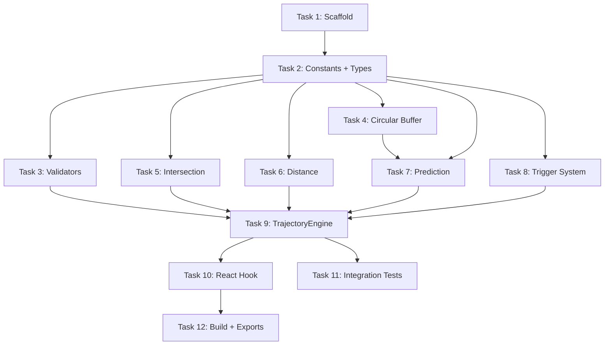
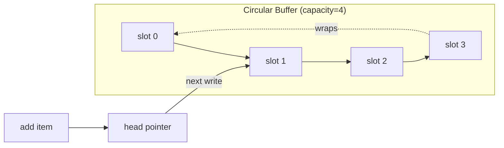
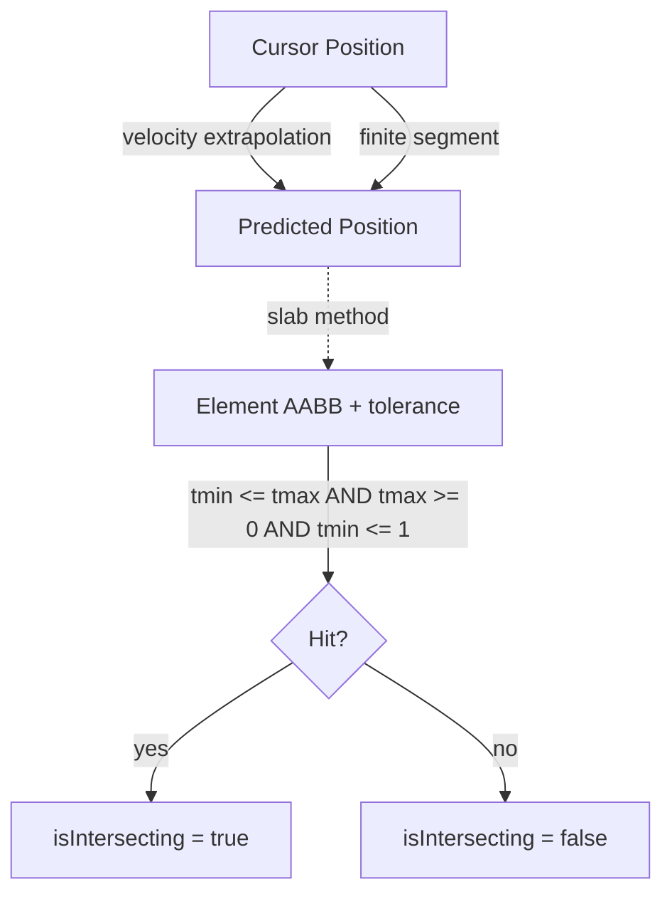
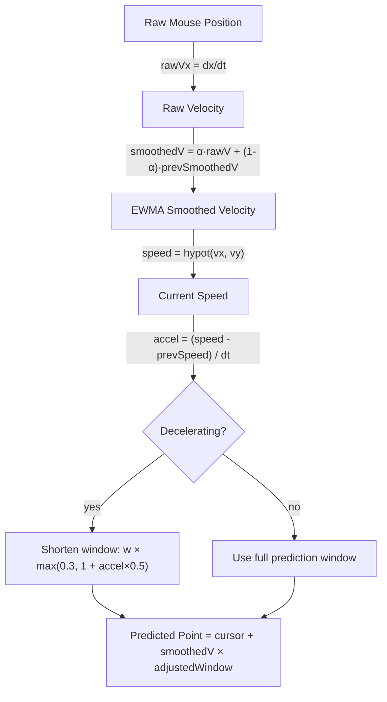
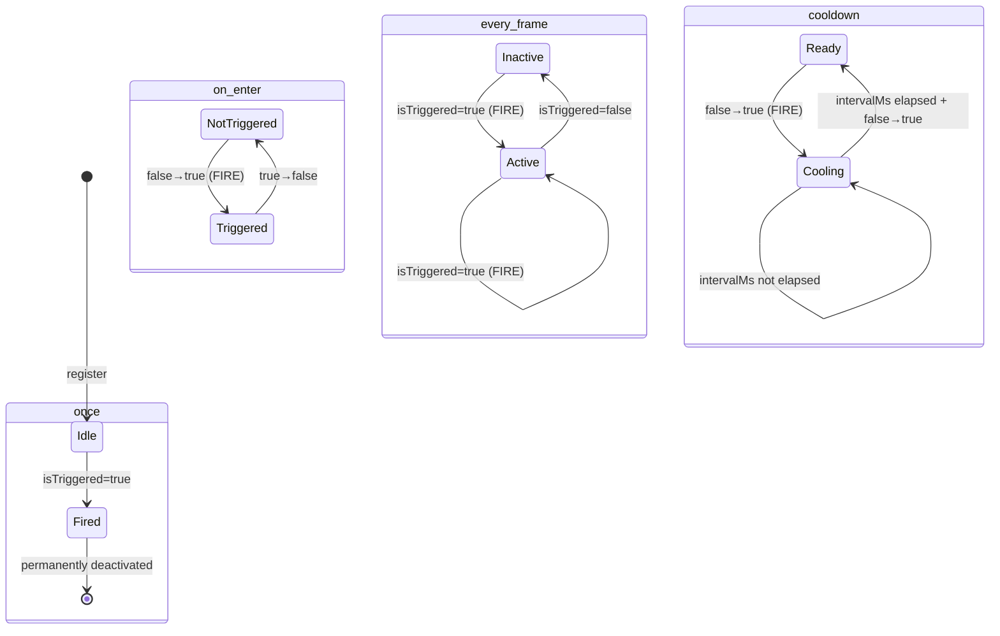
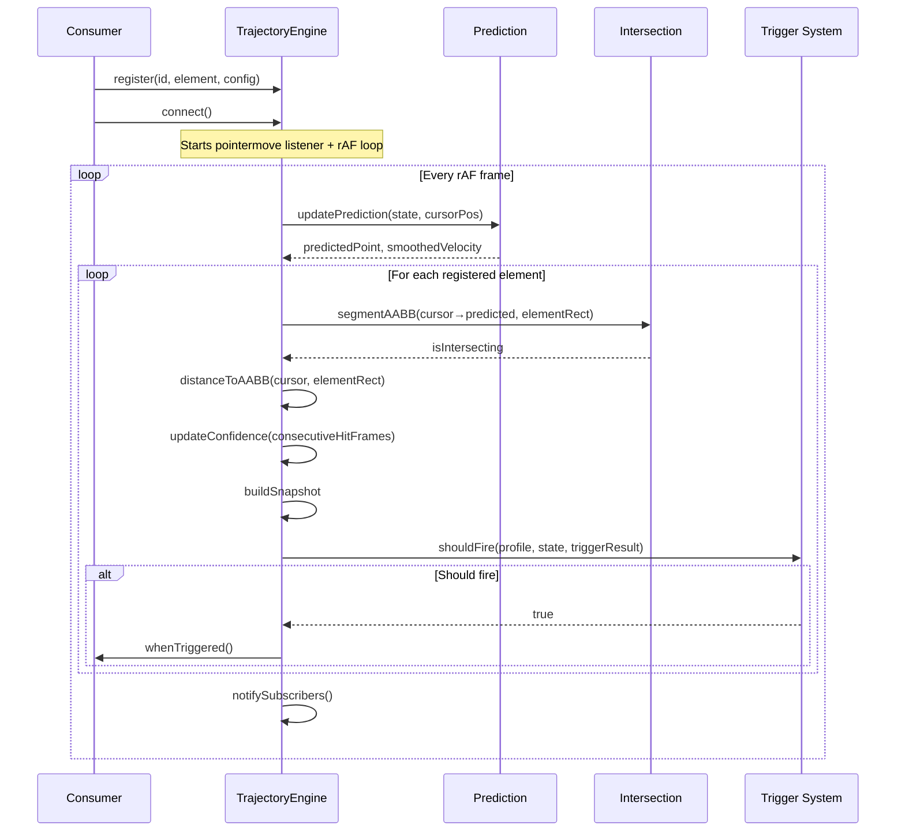

# useTrajectory Implementation Plan

> **For Claude:** REQUIRED SUB-SKILL: Use superpowers:executing-plans to implement this plan task-by-task.

**Goal:** Implement `foresee` — a cursor trajectory prediction library with a framework-agnostic core and React hook.

**Architecture:** Core engine (`src/core/`) handles prediction math, intersection tests, and trigger evaluation. React wrapper (`src/react/`) is a thin hook using `useSyncExternalStore`. Zero external runtime dependencies.

**Tech Stack:** TypeScript (strict), Vitest + happy-dom, tsup (ESM + CJS), React 19, pnpm.

---

## Dependency Graph



## Task Order

| Task | Name | Depends On | Est. Time |
|------|------|-----------|-----------|
| 1 | Project Scaffold | — | 10 min |
| 2 | Constants + Types | 1 | 10 min |
| 3 | Validators | 2 | 10 min |
| 4 | Circular Buffer | 2 | 15 min |
| 5 | Segment-AABB Intersection | 2 | 15 min |
| 6 | Point-to-AABB Distance | 2 | 10 min |
| 7 | Prediction (EWMA + Extrapolation) | 2, 4 | 20 min |
| 8 | Trigger System | 2 | 15 min |
| 9 | TrajectoryEngine | 3, 5, 6, 7, 8 | 30 min |
| 10 | React Hook (useTrajectory) | 9 | 20 min |
| 11 | Integration Tests | 9 | 15 min |
| 12 | Build + Package Exports | 10 | 10 min |

---

## Task 1: Project Scaffold

**Files:**
- Create: `tsconfig.json`
- Create: `tsup.config.ts`
- Create: `vitest.config.ts`
- Modify: `package.json`
- Create: `src/core/index.ts` (empty barrel)
- Create: `src/react/index.ts` (empty barrel)
- Create: `src/index.ts` (empty barrel)

**Step 1: Install dev dependencies**

```bash
pnpm add -D typescript tsup vitest happy-dom @types/react
```

**Step 2: Create tsconfig.json**

```json
{
  "compilerOptions": {
    "target": "ES2020",
    "lib": ["ES2020", "DOM", "DOM.Iterable"],
    "jsx": "react-jsx",
    "module": "ESNext",
    "moduleResolution": "bundler",
    "strict": true,
    "esModuleInterop": true,
    "skipLibCheck": true,
    "forceConsistentCasingInFileNames": true,
    "declaration": true,
    "declarationMap": true,
    "sourceMap": true,
    "outDir": "dist",
    "rootDir": "src"
  },
  "include": ["src"],
  "exclude": ["node_modules", "dist", "**/*.test.ts"]
}
```

**Step 3: Create vitest.config.ts**

```typescript
import { defineConfig } from 'vitest/config'

export default defineConfig({
  test: {
    environment: 'happy-dom',
    include: ['src/**/*.test.ts'],
  },
})
```

**Step 4: Create tsup.config.ts**

```typescript
import { defineConfig } from 'tsup'

export default defineConfig({
  entry: {
    index: 'src/index.ts',
    core: 'src/core/index.ts',
    react: 'src/react/index.ts',
  },
  format: ['esm', 'cjs'],
  dts: true,
  sourcemap: true,
  clean: true,
  external: ['react'],
})
```

**Step 5: Update package.json**

Add scripts, exports, peerDependencies. Set `"type": "module"`.

**Step 6: Create empty barrel files**

```typescript
// src/core/index.ts
// Core engine — framework-agnostic

// src/react/index.ts
// React hook wrapper

// src/index.ts
export * from './core/index.js'
```

**Step 7: Verify scaffold works**

```bash
pnpm exec vitest run        # Should pass (no tests yet)
pnpm exec tsup              # Should build (empty barrels)
pnpm exec tsc --noEmit      # Should pass
```

**Step 8: Commit**

```bash
git add -A && git commit -m "feat: project scaffold — tsup, vitest, tsconfig, package exports"
```

---

## Task 2: Constants + Types

**Files:**
- Create: `src/core/constants.ts`
- Create: `src/core/types.ts`
- Test: `src/core/constants.test.ts`

**Step 1: Write the constants test**

```typescript
// src/core/constants.test.ts
import { describe, it, expect } from 'vitest'
import * as C from './constants.js'

describe('constants', () => {
  it('has valid prediction window range', () => {
    expect(C.MIN_PREDICTION_WINDOW_MS).toBeLessThan(C.MAX_PREDICTION_WINDOW_MS)
    expect(C.DEFAULT_PREDICTION_WINDOW_MS).toBeGreaterThanOrEqual(C.MIN_PREDICTION_WINDOW_MS)
    expect(C.DEFAULT_PREDICTION_WINDOW_MS).toBeLessThanOrEqual(C.MAX_PREDICTION_WINDOW_MS)
  })

  it('has valid buffer size range', () => {
    expect(C.MIN_BUFFER_SIZE).toBeLessThan(C.MAX_BUFFER_SIZE)
    expect(C.DEFAULT_BUFFER_SIZE).toBeGreaterThanOrEqual(C.MIN_BUFFER_SIZE)
    expect(C.DEFAULT_BUFFER_SIZE).toBeLessThanOrEqual(C.MAX_BUFFER_SIZE)
  })

  it('has valid smoothing factor', () => {
    expect(C.DEFAULT_SMOOTHING_FACTOR).toBeGreaterThan(0)
    expect(C.DEFAULT_SMOOTHING_FACTOR).toBeLessThanOrEqual(1)
  })

  it('has valid confidence saturation', () => {
    expect(C.CONFIDENCE_SATURATION_FRAMES).toBeGreaterThan(0)
  })
})
```

**Step 2: Run test to verify it fails**

```bash
pnpm exec vitest run src/core/constants.test.ts
```
Expected: FAIL — module not found

**Step 3: Implement constants.ts and types.ts**

```typescript
// src/core/constants.ts — see design doc "Constants" section for full list

// src/core/types.ts — see design doc "Core Types" section
// Point, Velocity, Tolerance, Rect, TrajectorySnapshot,
// TriggerResult, TriggerProfile, ElementConfig, EngineOptions
```

**Step 4: Run test to verify it passes**

```bash
pnpm exec vitest run src/core/constants.test.ts
```
Expected: PASS

**Step 5: Commit**

```bash
git add -A && git commit -m "feat: add constants and type definitions"
```

---

## Task 3: Validators

**Files:**
- Create: `src/core/validators.ts`
- Test: `src/core/validators.test.ts`

**Step 1: Write the failing test**

```typescript
// src/core/validators.test.ts
import { describe, it, expect } from 'vitest'
import { validateEngineOptions, validateElementConfig, normalizeTolerance } from './validators.js'

describe('validateEngineOptions', () => {
  it('accepts valid options', () => {
    expect(() => validateEngineOptions({ predictionWindow: 150 })).not.toThrow()
  })

  it('accepts undefined (all defaults)', () => {
    expect(() => validateEngineOptions(undefined)).not.toThrow()
  })

  it('rejects predictionWindow out of range', () => {
    expect(() => validateEngineOptions({ predictionWindow: 5 })).toThrow(/predictionWindow/)
    expect(() => validateEngineOptions({ predictionWindow: 600 })).toThrow(/predictionWindow/)
  })

  it('rejects invalid smoothingFactor', () => {
    expect(() => validateEngineOptions({ smoothingFactor: -1 })).toThrow(/smoothingFactor/)
    expect(() => validateEngineOptions({ smoothingFactor: 2 })).toThrow(/smoothingFactor/)
  })
})

describe('normalizeTolerance', () => {
  it('converts number to Rect', () => {
    expect(normalizeTolerance(10)).toEqual({ top: 10, right: 10, bottom: 10, left: 10 })
  })

  it('passes through Rect unchanged', () => {
    const rect = { top: 1, right: 2, bottom: 3, left: 4 }
    expect(normalizeTolerance(rect)).toEqual(rect)
  })

  it('defaults to zero', () => {
    expect(normalizeTolerance(undefined)).toEqual({ top: 0, right: 0, bottom: 0, left: 0 })
  })
})
```

**Step 2: Run test, verify FAIL**

```bash
pnpm exec vitest run src/core/validators.test.ts
```

**Step 3: Implement validators**

Guard functions that throw descriptive `Error` on invalid input. Used only at registration boundaries.

**Step 4: Run test, verify PASS**

**Step 5: Commit**

```bash
git add -A && git commit -m "feat: add hand-rolled validators for engine options and element config"
```

---

## Task 4: Circular Buffer

**Files:**
- Create: `src/core/buffer.ts`
- Test: `src/core/buffer.test.ts`



**Step 1: Write the failing test**

```typescript
// src/core/buffer.test.ts
import { describe, it, expect } from 'vitest'
import { CircularBuffer } from './buffer.js'

describe('CircularBuffer', () => {
  it('stores and retrieves items', () => {
    const buf = new CircularBuffer<number>(4)
    buf.add(1)
    buf.add(2)
    expect(buf.getLast()).toBe(2)
    expect(buf.getFirst()).toBe(1)
    expect(buf.length).toBe(2)
  })

  it('wraps around when full', () => {
    const buf = new CircularBuffer<number>(3)
    buf.add(1)
    buf.add(2)
    buf.add(3)
    buf.add(4) // overwrites 1
    expect(buf.getFirst()).toBe(2)
    expect(buf.getLast()).toBe(4)
    expect(buf.length).toBe(3)
  })

  it('returns first and last efficiently', () => {
    const buf = new CircularBuffer<number>(8)
    for (let i = 0; i < 20; i++) buf.add(i)
    const [first, last] = buf.getFirstLast()
    expect(first).toBe(12) // 20 - 8
    expect(last).toBe(19)
  })

  it('handles empty buffer', () => {
    const buf = new CircularBuffer<number>(4)
    expect(buf.length).toBe(0)
    expect(buf.getLast()).toBeUndefined()
    expect(buf.getFirst()).toBeUndefined()
  })

  it('clears all items', () => {
    const buf = new CircularBuffer<number>(4)
    buf.add(1)
    buf.add(2)
    buf.clear()
    expect(buf.length).toBe(0)
    expect(buf.getLast()).toBeUndefined()
  })

  it('rejects invalid capacity', () => {
    expect(() => new CircularBuffer(0)).toThrow()
    expect(() => new CircularBuffer(-1)).toThrow()
  })
})
```

**Step 2: Run test, verify FAIL**

**Step 3: Implement CircularBuffer**

Fixed-size array with head pointer and count. O(1) add/get. See design doc.

**Step 4: Run test, verify PASS**

**Step 5: Commit**

```bash
git add -A && git commit -m "feat: add CircularBuffer for position history"
```

---

## Task 5: Segment-AABB Intersection

**Files:**
- Create: `src/core/intersection.ts`
- Test: `src/core/intersection.test.ts`



**Step 1: Write the failing test**

```typescript
// src/core/intersection.test.ts
import { describe, it, expect } from 'vitest'
import { segmentAABB } from './intersection.js'

describe('segmentAABB', () => {
  // Box from (100,100) to (200,200)
  const box = { minX: 100, minY: 100, maxX: 200, maxY: 200 }

  it('detects hit — segment passes through box', () => {
    // Segment from (50,150) in direction (200,0) — horizontal through center
    expect(segmentAABB(50, 150, 200, 0, box.minX, box.minY, box.maxX, box.maxY)).toBe(true)
  })

  it('detects miss — segment parallel above box', () => {
    expect(segmentAABB(50, 50, 200, 0, box.minX, box.minY, box.maxX, box.maxY)).toBe(false)
  })

  it('detects hit — segment starts inside box', () => {
    expect(segmentAABB(150, 150, 10, 10, box.minX, box.minY, box.maxX, box.maxY)).toBe(true)
  })

  it('detects miss — segment too short to reach box', () => {
    // Segment from (50,150) with direction (20,0) — only reaches x=70, box starts at 100
    expect(segmentAABB(50, 150, 20, 0, box.minX, box.minY, box.maxX, box.maxY)).toBe(false)
  })

  it('detects miss — segment points away from box', () => {
    expect(segmentAABB(50, 150, -100, 0, box.minX, box.minY, box.maxX, box.maxY)).toBe(false)
  })

  it('handles zero-length segment (stationary cursor)', () => {
    // dx=0, dy=0 — cursor not moving. Should not intersect.
    expect(segmentAABB(50, 150, 0, 0, box.minX, box.minY, box.maxX, box.maxY)).toBe(false)
  })

  it('handles vertical segment (dx = 0)', () => {
    // Vertical segment at x=150, moving down through box
    expect(segmentAABB(150, 50, 0, 200, box.minX, box.minY, box.maxX, box.maxY)).toBe(true)
  })

  it('handles horizontal segment (dy = 0)', () => {
    expect(segmentAABB(50, 150, 200, 0, box.minX, box.minY, box.maxX, box.maxY)).toBe(true)
  })

  it('detects hit — diagonal through corner', () => {
    expect(segmentAABB(50, 50, 200, 200, box.minX, box.minY, box.maxX, box.maxY)).toBe(true)
  })

  it('detects hit — segment exactly touches edge', () => {
    // Segment from (50,100) rightward along top edge
    expect(segmentAABB(50, 100, 200, 0, box.minX, box.minY, box.maxX, box.maxY)).toBe(true)
  })
})
```

**Step 2: Run test, verify FAIL**

**Step 3: Implement branchless slab method**

See design doc "Intersection Test" section. Key: `tmin <= 1` for finite segment.

**Step 4: Run test, verify PASS**

**Step 5: Commit**

```bash
git add -A && git commit -m "feat: add branchless slab method for segment-AABB intersection"
```

---

## Task 6: Point-to-AABB Distance

**Files:**
- Create: `src/core/distance.ts`
- Test: `src/core/distance.test.ts`

**Step 1: Write the failing test**

```typescript
// src/core/distance.test.ts
import { describe, it, expect } from 'vitest'
import { distanceToAABB } from './distance.js'

describe('distanceToAABB', () => {
  // Box from (100,100) to (200,200)
  const rect = { left: 100, top: 100, right: 200, bottom: 200 }

  it('returns 0 when point is inside', () => {
    expect(distanceToAABB(150, 150, rect)).toBe(0)
  })

  it('returns horizontal distance when point is left of box', () => {
    expect(distanceToAABB(80, 150, rect)).toBe(20)
  })

  it('returns vertical distance when point is above box', () => {
    expect(distanceToAABB(150, 80, rect)).toBe(20)
  })

  it('returns diagonal distance from corner', () => {
    expect(distanceToAABB(80, 80, rect)).toBeCloseTo(Math.hypot(20, 20))
  })

  it('returns 0 when point is on edge', () => {
    expect(distanceToAABB(100, 150, rect)).toBe(0)
  })
})
```

**Step 2: Run test, verify FAIL**

**Step 3: Implement clamped distance**

See design doc "Distance Calculation" section.

**Step 4: Run test, verify PASS**

**Step 5: Commit**

```bash
git add -A && git commit -m "feat: add point-to-AABB distance calculation"
```

---

## Task 7: Prediction (EWMA + Extrapolation)

**Files:**
- Create: `src/core/prediction.ts`
- Test: `src/core/prediction.test.ts`



**Step 1: Write the failing test**

```typescript
// src/core/prediction.test.ts
import { describe, it, expect } from 'vitest'
import { PredictionState, updatePrediction } from './prediction.js'
import { DEFAULT_SMOOTHING_FACTOR, DEFAULT_PREDICTION_WINDOW_MS } from './constants.js'

describe('EWMA velocity smoothing', () => {
  it('converges to constant velocity', () => {
    const state = createPredictionState()
    // Simulate 20 frames at constant velocity (10px/frame, 60fps)
    for (let i = 0; i < 20; i++) {
      updatePrediction(state, { x: i * 10, y: 0, timestamp: i * 16.67 })
    }
    expect(state.smoothedVx).toBeCloseTo(600, -1) // ~600 px/s
    expect(state.smoothedVy).toBeCloseTo(0, 1)
  })

  it('smooths out jittery input', () => {
    const state = createPredictionState()
    // Alternate between 10px and 12px movements (jitter)
    for (let i = 0; i < 20; i++) {
      const dx = i % 2 === 0 ? 10 : 12
      updatePrediction(state, { x: i * 11, y: 0, timestamp: i * 16.67 })
    }
    // Smoothed velocity should be stable, not oscillating
    const vx1 = state.smoothedVx
    updatePrediction(state, { x: 20 * 11, y: 0, timestamp: 20 * 16.67 })
    const vx2 = state.smoothedVx
    expect(Math.abs(vx2 - vx1)).toBeLessThan(50) // Not oscillating wildly
  })
})

describe('acceleration detection', () => {
  it('detects deceleration and shortens prediction window', () => {
    const state = createPredictionState()
    // Fast movement then slow down
    for (let i = 0; i < 10; i++) {
      updatePrediction(state, { x: i * 20, y: 0, timestamp: i * 16.67 })
    }
    const windowFast = state.adjustedWindowMs

    // Now decelerate
    for (let i = 10; i < 20; i++) {
      updatePrediction(state, { x: 200 + (i - 10) * 5, y: 0, timestamp: i * 16.67 })
    }
    const windowSlow = state.adjustedWindowMs

    expect(windowSlow).toBeLessThan(windowFast)
  })
})

describe('point extrapolation', () => {
  it('predicts point ahead of cursor', () => {
    const state = createPredictionState()
    // Move right at constant velocity
    for (let i = 0; i < 10; i++) {
      updatePrediction(state, { x: i * 10, y: 0, timestamp: i * 16.67 })
    }
    expect(state.predictedPoint.x).toBeGreaterThan(90) // Ahead of current pos
    expect(state.predictedPoint.y).toBeCloseTo(0, 0)
  })

  it('returns current position when stationary', () => {
    const state = createPredictionState()
    updatePrediction(state, { x: 100, y: 100, timestamp: 0 })
    updatePrediction(state, { x: 100, y: 100, timestamp: 16.67 })
    expect(state.predictedPoint.x).toBeCloseTo(100, 0)
    expect(state.predictedPoint.y).toBeCloseTo(100, 0)
  })
})
```

**Step 2: Run test, verify FAIL**

**Step 3: Implement**

- `PredictionState` interface: smoothedVx/Vy, previousSpeed, adjustedWindowMs, predictedPoint, circular buffer ref
- `createPredictionState()` factory
- `updatePrediction(state, cursorEvent)` mutates state in place (hot path, no allocations)

**Step 4: Run test, verify PASS**

**Step 5: Commit**

```bash
git add -A && git commit -m "feat: add EWMA prediction with acceleration-based window adjustment"
```

---

## Task 8: Trigger System

**Files:**
- Create: `src/core/triggers.ts`
- Test: `src/core/triggers.test.ts`



**Step 1: Write the failing test**

```typescript
// src/core/triggers.test.ts
import { describe, it, expect } from 'vitest'
import { createElementState, shouldFire, updateElementState } from './triggers.js'

describe('trigger profile: once', () => {
  it('fires on first trigger', () => {
    const state = createElementState()
    expect(shouldFire({ type: 'once' }, state, true, 0)).toBe(true)
  })

  it('never fires again after first trigger', () => {
    const state = createElementState()
    shouldFire({ type: 'once' }, state, true, 0)
    updateElementState(state, true, 0)
    state.hasFiredOnce = true
    expect(shouldFire({ type: 'once' }, state, true, 16)).toBe(false)
  })
})

describe('trigger profile: on_enter', () => {
  it('fires on false→true transition', () => {
    const state = createElementState()
    state.wasTriggeredLastFrame = false
    expect(shouldFire({ type: 'on_enter' }, state, true, 0)).toBe(true)
  })

  it('does not fire while staying triggered', () => {
    const state = createElementState()
    state.wasTriggeredLastFrame = true
    expect(shouldFire({ type: 'on_enter' }, state, true, 16)).toBe(false)
  })

  it('fires again after leaving and re-entering', () => {
    const state = createElementState()
    state.wasTriggeredLastFrame = false
    expect(shouldFire({ type: 'on_enter' }, state, true, 0)).toBe(true)
    state.wasTriggeredLastFrame = true
    expect(shouldFire({ type: 'on_enter' }, state, true, 16)).toBe(false)
    state.wasTriggeredLastFrame = false // left
    expect(shouldFire({ type: 'on_enter' }, state, true, 32)).toBe(true)
  })
})

describe('trigger profile: every_frame', () => {
  it('fires every frame while triggered', () => {
    const state = createElementState()
    expect(shouldFire({ type: 'every_frame' }, state, true, 0)).toBe(true)
    expect(shouldFire({ type: 'every_frame' }, state, true, 16)).toBe(true)
  })

  it('does not fire when not triggered', () => {
    const state = createElementState()
    expect(shouldFire({ type: 'every_frame' }, state, false, 0)).toBe(false)
  })
})

describe('trigger profile: cooldown', () => {
  it('fires on first enter', () => {
    const state = createElementState()
    expect(shouldFire({ type: 'cooldown', intervalMs: 300 }, state, true, 0)).toBe(true)
  })

  it('does not fire during cooldown period', () => {
    const state = createElementState()
    state.wasTriggeredLastFrame = false
    state.lastFireTimestamp = 100
    expect(shouldFire({ type: 'cooldown', intervalMs: 300 }, state, true, 200)).toBe(false) // 100ms < 300ms
  })

  it('fires after cooldown expires', () => {
    const state = createElementState()
    state.wasTriggeredLastFrame = false
    state.lastFireTimestamp = 100
    expect(shouldFire({ type: 'cooldown', intervalMs: 300 }, state, true, 500)).toBe(true) // 400ms > 300ms
  })
})
```

**Step 2: Run test, verify FAIL**

**Step 3: Implement**

- `ElementState` interface (see design doc)
- `createElementState()` factory
- `shouldFire(profile, state, isTriggered, now)` → boolean
- `updateElementState(state, isTriggered, now)` — updates wasTriggeredLastFrame etc.

**Step 4: Run test, verify PASS**

**Step 5: Commit**

```bash
git add -A && git commit -m "feat: add trigger profiles — once, on_enter, every_frame, cooldown"
```

---

## Task 9: TrajectoryEngine

**Files:**
- Create: `src/core/engine.ts`
- Test: `src/core/engine.test.ts`

This is the largest task — the orchestrator that ties everything together.



**Step 1: Write the failing test**

```typescript
// src/core/engine.test.ts
import { describe, it, expect, vi, beforeEach, afterEach } from 'vitest'
import { TrajectoryEngine } from './engine.js'

describe('TrajectoryEngine', () => {
  describe('lifecycle', () => {
    it('creates with default options', () => {
      const engine = new TrajectoryEngine()
      expect(engine).toBeDefined()
    })

    it('creates with custom options', () => {
      const engine = new TrajectoryEngine({ predictionWindow: 200, bufferSize: 12 })
      expect(engine).toBeDefined()
    })

    it('rejects invalid options', () => {
      expect(() => new TrajectoryEngine({ predictionWindow: 5 })).toThrow()
    })
  })

  describe('registration', () => {
    it('registers and unregisters elements', () => {
      const engine = new TrajectoryEngine()
      const el = document.createElement('div')
      const config = { triggerOn: () => ({ isTriggered: false }), whenTriggered: () => {}, profile: { type: 'once' as const } }

      engine.register('test', el, config)
      expect(engine.getSnapshot('test')).toBeUndefined() // No snapshot until connected + moved

      engine.unregister('test')
      expect(engine.getSnapshot('test')).toBeUndefined()
    })

    it('re-register updates config', () => {
      const engine = new TrajectoryEngine()
      const el = document.createElement('div')
      const cb1 = vi.fn()
      const cb2 = vi.fn()

      engine.register('test', el, { triggerOn: () => ({ isTriggered: true }), whenTriggered: cb1, profile: { type: 'once' } })
      engine.register('test', el, { triggerOn: () => ({ isTriggered: true }), whenTriggered: cb2, profile: { type: 'once' } })

      // cb2 should be the active callback, not cb1
      // (verified in integration tests with actual mouse events)
    })
  })

  describe('subscriptions', () => {
    it('subscribe returns unsubscribe function', () => {
      const engine = new TrajectoryEngine()
      const cb = vi.fn()
      const unsubscribe = engine.subscribe(cb)
      expect(typeof unsubscribe).toBe('function')
      unsubscribe()
    })

    it('subscribeToElement returns factory function', () => {
      const engine = new TrajectoryEngine()
      const factory = engine.subscribeToElement('test')
      expect(typeof factory).toBe('function')
      const unsubscribe = factory(() => {})
      expect(typeof unsubscribe).toBe('function')
      unsubscribe()
    })
  })

  describe('connect/disconnect', () => {
    it('connect adds event listener', () => {
      const engine = new TrajectoryEngine()
      const addSpy = vi.spyOn(document, 'addEventListener')
      engine.connect()
      expect(addSpy).toHaveBeenCalledWith('pointermove', expect.any(Function))
      engine.disconnect()
      addSpy.mockRestore()
    })

    it('disconnect removes event listener', () => {
      const engine = new TrajectoryEngine()
      const removeSpy = vi.spyOn(document, 'removeEventListener')
      engine.connect()
      engine.disconnect()
      expect(removeSpy).toHaveBeenCalled()
      removeSpy.mockRestore()
    })

    it('destroy fully tears down', () => {
      const engine = new TrajectoryEngine()
      engine.connect()
      engine.destroy()
      // Should not throw on double-destroy
      expect(() => engine.destroy()).not.toThrow()
    })
  })
})
```

**Step 2: Run test, verify FAIL**

**Step 3: Implement TrajectoryEngine class**

The engine orchestrates all core modules. See design doc "Engine Class" and "Update Loop" sections.

Key implementation details:
- Stores registered elements in `Map<string, { element, config, state, cachedRect }>`
- On `pointermove`: stores latest event, requests rAF
- On rAF: runs full update loop (predict → intersect → distance → confidence → trigger → notify)
- `subscribe()` and `subscribeToElement()` maintain Sets of callbacks
- Convenience API: if config has `whenApproaching`, expand it to full triggerOn/whenTriggered

**Step 4: Run test, verify PASS**

**Step 5: Commit**

```bash
git add -A && git commit -m "feat: add TrajectoryEngine — core orchestrator"
```

---

## Task 10: React Hook (useTrajectory)

**Files:**
- Create: `src/react/useTrajectory.ts`
- Test: `src/react/useTrajectory.test.ts`
- Update: `src/react/index.ts`

**Step 1: Write the failing test**

```typescript
// src/react/useTrajectory.test.ts
import { describe, it, expect, vi } from 'vitest'
import { renderHook, act } from '@testing-library/react'
import { useTrajectory } from './useTrajectory.js'

// Note: need to install @testing-library/react as devDep

describe('useTrajectory', () => {
  it('returns register, useSnapshot, and getSnapshot', () => {
    const { result } = renderHook(() => useTrajectory())
    expect(result.current.register).toBeDefined()
    expect(result.current.useSnapshot).toBeDefined()
    expect(result.current.getSnapshot).toBeDefined()
  })

  it('register returns a ref callback', () => {
    const { result } = renderHook(() => useTrajectory())
    const ref = result.current.register('test', {
      triggerOn: () => ({ isTriggered: false }),
      whenTriggered: () => {},
      profile: { type: 'once' },
    })
    expect(typeof ref).toBe('function')
  })

  it('getSnapshot returns undefined for unregistered element', () => {
    const { result } = renderHook(() => useTrajectory())
    expect(result.current.getSnapshot('nonexistent')).toBeUndefined()
  })

  it('SSR safe — does not crash without window', () => {
    // happy-dom provides window, but the hook should handle missing window
    const { result } = renderHook(() => useTrajectory())
    expect(result.current).toBeDefined()
  })
})
```

**Step 2: Install test dep, run test, verify FAIL**

```bash
pnpm add -D @testing-library/react
pnpm exec vitest run src/react/useTrajectory.test.ts
```

**Step 3: Implement useTrajectory hook**

See design doc "React Hook Implementation" section. Key: configsRef pattern, useSyncExternalStore, RefCallback.

**Step 4: Run test, verify PASS**

**Step 5: Update barrel exports**

```typescript
// src/react/index.ts
export { useTrajectory } from './useTrajectory.js'

// src/core/index.ts
export { TrajectoryEngine } from './engine.js'
export type { TrajectorySnapshot, ElementConfig, EngineOptions, ... } from './types.js'
export { ... } from './constants.js'
```

**Step 6: Commit**

```bash
git add -A && git commit -m "feat: add useTrajectory React hook with per-element subscriptions"
```

---

## Task 11: Integration Tests

**Files:**
- Create: `src/core/engine.integration.test.ts`

**Step 1: Write integration tests**

```typescript
// src/core/engine.integration.test.ts
import { describe, it, expect, vi, beforeEach } from 'vitest'
import { TrajectoryEngine } from './engine.js'

describe('TrajectoryEngine integration', () => {
  let engine: TrajectoryEngine

  beforeEach(() => {
    engine = new TrajectoryEngine({ predictionWindow: 150 })
  })

  it('full loop: register → move → snapshot → callback', async () => {
    const el = document.createElement('div')
    // Mock getBoundingClientRect
    vi.spyOn(el, 'getBoundingClientRect').mockReturnValue({
      left: 100, top: 100, right: 200, bottom: 200,
      width: 100, height: 100, x: 100, y: 100, toJSON: () => {},
    })

    const callback = vi.fn()
    engine.register('btn', el, {
      triggerOn: (snap) => ({ isTriggered: snap.isIntersecting }),
      whenTriggered: callback,
      profile: { type: 'on_enter' },
    })
    engine.connect()

    // Simulate mouse moving toward element
    // (dispatch pointermove events, trigger rAF)
    // ... test framework specific

    engine.destroy()
  })

  it('cleanup: unregister removes snapshot', () => {
    const el = document.createElement('div')
    engine.register('btn', el, {
      triggerOn: () => ({ isTriggered: false }),
      whenTriggered: () => {},
      profile: { type: 'once' },
    })
    engine.unregister('btn')
    expect(engine.getSnapshot('btn')).toBeUndefined()
    expect(engine.getAllSnapshots().size).toBe(0)
  })

  it('multiple elements have independent snapshots', () => {
    const el1 = document.createElement('div')
    const el2 = document.createElement('div')
    engine.register('a', el1, { triggerOn: () => ({ isTriggered: false }), whenTriggered: () => {}, profile: { type: 'once' } })
    engine.register('b', el2, { triggerOn: () => ({ isTriggered: false }), whenTriggered: () => {}, profile: { type: 'once' } })
    expect(engine.getAllSnapshots().size).toBe(0) // No snapshots until connected + moved
    engine.unregister('a')
    // 'b' should still be registered
  })
})
```

**Step 2: Run, verify PASS**

**Step 3: Commit**

```bash
git add -A && git commit -m "test: add integration tests for full engine lifecycle"
```

---

## Task 12: Build + Package Exports

**Files:**
- Modify: `package.json` (final exports config)

**Step 1: Verify full test suite passes**

```bash
pnpm exec vitest run
```

**Step 2: Verify build succeeds**

```bash
pnpm exec tsup
```

**Step 3: Verify package exports resolve**

```bash
node -e "const p = require('./dist/core.cjs'); console.log(Object.keys(p))"
node --input-type=module -e "import { TrajectoryEngine } from './dist/core.js'; console.log(typeof TrajectoryEngine)"
```

**Step 4: Verify TypeScript types generate**

```bash
ls dist/*.d.ts
```

**Step 5: Final commit**

```bash
git add -A && git commit -m "feat: finalize build configuration and package exports"
```

---

## Execution Summary

```mermaid
gantt
    title Implementation Timeline
    dateFormat  HH:mm
    axisFormat %H:%M

    section Foundation
    Task 1 - Scaffold           :t1, 00:00, 10m
    Task 2 - Constants + Types  :t2, after t1, 10m
    Task 3 - Validators         :t3, after t2, 10m

    section Core Math
    Task 4 - Circular Buffer    :t4, after t2, 15m
    Task 5 - Intersection       :t5, after t2, 15m
    Task 6 - Distance           :t6, after t2, 10m

    section Prediction
    Task 7 - EWMA + Extrap      :t7, after t4, 20m

    section Trigger
    Task 8 - Trigger System     :t8, after t2, 15m

    section Engine
    Task 9 - TrajectoryEngine   :t9, after t7, 30m

    section React
    Task 10 - useTrajectory     :t10, after t9, 20m

    section Verification
    Task 11 - Integration Tests :t11, after t9, 15m
    Task 12 - Build + Exports   :t12, after t10, 10m
```



**Total estimated time: ~3 hours**
**Total commits: 12 atomic commits (one per task)**
